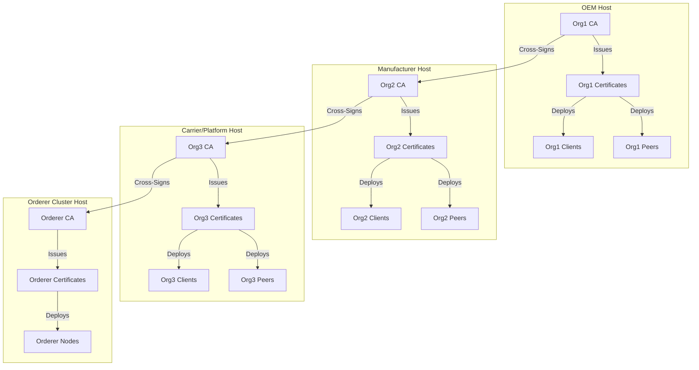
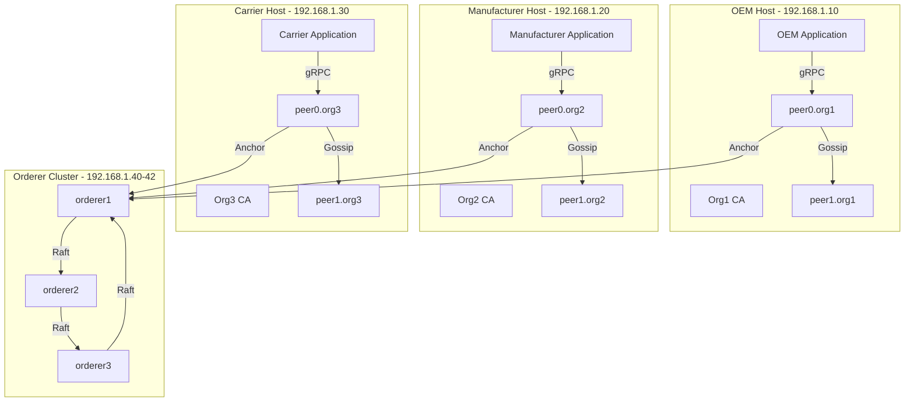
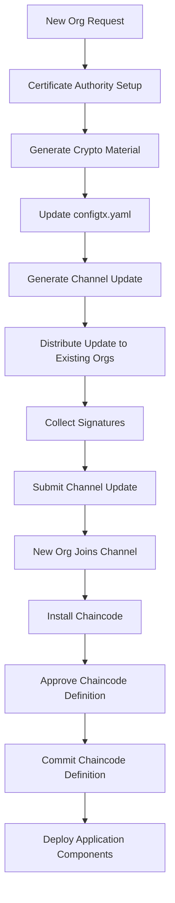
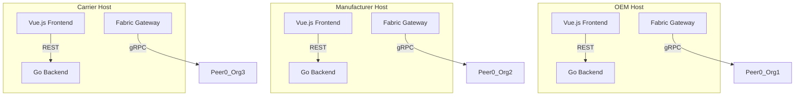
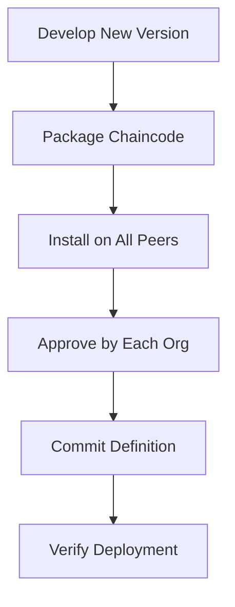

# Hyperledger Fabric Network Topology Mapping v2.0

## Introduction

This document presents the advanced architecture design for deploying the Hyperledger Fabric network across multiple hosts, enabling independent organization deployment while maintaining the integrity of the blockchain consortium. The current implementation successfully demonstrates a 3-organization supply chain network on a single host, but production requirements demand distributed deployment with enhanced security isolation and scalability.

### Architecture Vision

**Objective**: Enable each business entity (OEM, Manufacturer, Carrier, Platform) to independently deploy and manage their Fabric infrastructure while participating in a unified blockchain consortium.

**Key Principles**:
- **Identity Isolation**: Independent MSP boundaries with separate Certificate Authorities
- **Operational Autonomy**: Organizations control their own peer nodes and client applications
- **Consortium Unity**: Maintain shared ledger and consensus through distributed orderer service
- **Scalable Governance**: Support dynamic organization onboarding without disrupting existing operations

## MSP & Org Mapping

### Organization Trust Matrix

| Org ID | MSP ID | Business Role | Trust Level | Certificate Authority | Domain | Anchor Peer |
|--------|--------|---------------|-------------|-----------------------|--------|-------------|
| Org1 | Org1MSP | OEM (Original Equipment Manufacturer) | High | CA1 | org1.togettoyou.com | peer0.org1.togettoyou.com |
| Org2 | Org2MSP | Manufacturer | Medium | CA2 | org2.togettoyou.com | peer0.org2.togettoyou.com |
| Org3 | Org3MSP | Carrier + Platform | High | CA3 | org3.togettoyou.com | peer0.org3.togettoyou.com |
| OrdererOrg | OrdererMSP | Consortium Orderer Service | Critical | OrdererCA | togettoyou.com | N/A |

### MSP Isolation Rationale

**Org1 (OEM)**: Requires independent MSP to maintain strict control over order creation and validation processes. As the supply chain initiator, OEM needs cryptographic isolation to prevent unauthorized order modifications.

**Org2 (Manufacturer)**: Separate MSP ensures manufacturing data integrity and prevents cross-contamination with carrier logistics data. Manufacturing processes contain proprietary information that must be protected.

**Org3 (Carrier + Platform)**: Dual-role organization requires independent MSP to separate carrier operations from platform monitoring functions. The platform role needs elevated privileges for cross-organization data access.

**OrdererOrg**: Dedicated MSP for the Raft-based ordering service ensures neutral consensus and prevents any single organization from controlling transaction ordering.

### Certificate Authority Architecture



## Node Specification

### Peer Node Configuration

```yaml
# Peer Node Environment Variables (Per Organization)
environment:
  - CORE_PEER_ID=peer0.org1.togettoyou.com
  - CORE_PEER_LOCALMSPID=Org1MSP
  - CORE_PEER_ADDRESS=peer0.org1.togettoyou.com:7051
  - CORE_PEER_CHAINCODEADDRESS=peer0.org1.togettoyou.com:7052
  - CORE_PEER_GOSSIP_BOOTSTRAP=peer1.org1.togettoyou.com:7051
  - CORE_PEER_GOSSIP_EXTERNALENDPOINT=peer0.org1.togettoyou.com:7051
  - CORE_PEER_TLS_ENABLED=true
  - CORE_PEER_TLS_CERT_FILE=/etc/hyperledger/peer/tls/server.crt
  - CORE_PEER_TLS_KEY_FILE=/etc/hyperledger/peer/tls/server.key
  - CORE_PEER_TLS_ROOTCERT_FILE=/etc/hyperledger/peer/tls/ca.crt
```

### Peer Role Assignment

| Peer Type | Function | Count per Org | Configuration |
|-----------|----------|---------------|---------------|
| **Anchor Peer** | Cross-organization communication gateway | 1 (peer0) | `CORE_PEER_GOSSIP_EXTERNALENDPOINT` configured |
| **Endorsing Peer** | Transaction validation and endorsement | 2 (peer0, peer1) | Chaincode installed, endorsement policies configured |
| **Committing Peer** | Block validation and ledger commit | 2 (peer0, peer1) | Full ledger replication, block validation enabled |

### Orderer Node Configuration

```yaml
# Orderer Node Environment Variables (Raft Cluster)
environment:
  - ORDERER_GENERAL_LISTENADDRESS=0.0.0.0
  - ORDERER_GENERAL_LISTENPORT=7050
  - ORDERER_GENERAL_GENESISMETHOD=file
  - ORDERER_GENERAL_GENESISFILE=/etc/hyperledger/config/genesis.block
  - ORDERER_GENERAL_LOCALMSPID=OrdererMSP
  - ORDERER_GENERAL_LOCALMSPDIR=/etc/hyperledger/orderer/msp
  - ORDERER_GENERAL_TLS_ENABLED=true
  - ORDERER_GENERAL_TLS_PRIVATEKEY=/etc/hyperledger/orderer/tls/server.key
  - ORDERER_GENERAL_TLS_CERTIFICATE=/etc/hyperledger/orderer/tls/server.crt
  - ORDERER_GENERAL_TLS_ROOTCAS=["/etc/hyperledger/orderer/tls/ca.crt"]
  - ORDERER_GENERAL_CLUSTER_CLIENTCERTIFICATE=/etc/hyperledger/orderer/tls/server.crt
  - ORDERER_GENERAL_CLUSTER_CLIENTPRIVATEKEY=/etc/hyperledger/orderer/tls/server.key
  - ORDERER_GENERAL_CLUSTER_ROOTCAS=["/etc/hyperledger/orderer/tls/ca.crt"]
  - ORDERER_GENERAL_BOOTSTRAPMETHOD=file
  - ORDERER_GENERAL_BOOTSTRAPFILE=/etc/hyperledger/config/genesis.block
```

### Resource Requirements

| Component | CPU | Memory | Storage | Network |
|-----------|-----|--------|---------|---------|
| Orderer Node | 2 cores | 4GB | 50GB (SSD) | 1Gbps |
| Peer Node | 2 cores | 4GB | 100GB (SSD) | 1Gbps |
| CA Server | 1 core | 2GB | 20GB | 100Mbps |
| Application Server | 2 cores | 4GB | 50GB | 1Gbps |

### Persistent Volume Configuration

```yaml
volumes:
  - ./data/orderer1.togettoyou.com:/var/hyperledger/production/orderer
  - ./data/peer0.org1.togettoyou.com:/var/hyperledger/production
  - ./crypto-config/ordererOrganizations/togettoyou.com/orderers/orderer1.togettoyou.com/:/etc/hyperledger/orderer
  - ./crypto-config/peerOrganizations/org1.togettoyou.com/peers/peer0.org1.togettoyou.com:/etc/hyperledger/peer
```

## Scalability Blueprint

### Multi-Host Deployment Architecture



### New Organization Onboarding Process



### Step-by-Step Onboarding Procedure

1. **Certificate Authority Setup**
   ```bash
   # On new organization host
   cryptogen generate --config=crypto-config-new-org.yaml --output=crypto-config
   ```

2. **Configuration Update**
   ```yaml
   # Add to configtx.yaml
   - &Org4
     Name: Org4
     ID: Org4MSP
     MSPDir: crypto-config/peerOrganizations/org4.togettoyou.com/msp
     AnchorPeers:
       - Host: peer0.org4.togettoyou.com
         Port: 7051
   ```

3. **Channel Configuration Update**
   ```bash
   # Generate config update
   configtxgen -profile SampleChannel -outputCreateChannelTx channel-update.tx -channelID mychannel
   
   # Sign and submit update
   peer channel update -o orderer1.togettoyou.com:7050 -c mychannel -f channel-update.tx --tls --cafile tls-cert.pem
   ```

4. **Join Channel and Deploy Chaincode**
   ```bash
   # New org joins channel
   peer channel join -b mychannel.block
   
   # Install and approve chaincode
   peer lifecycle chaincode install chaincode.tar.gz
   peer lifecycle chaincode approveformyorg -o orderer1.togettoyou.com:7050 --channelID mychannel --name mychaincode --version 1.0.0 --sequence 1
   ```

## Consensus Strategy

### Raft Orderer Cluster Design

**Rationale**: Raft consensus provides crash fault tolerance with 2n+1 node configuration. For production deployment, 3 orderer nodes provide optimal balance between fault tolerance and resource utilization.

**Cluster Configuration**:
```yaml
EtcdRaft:
  Consenters:
    - Host: orderer1.togettoyou.com
      Port: 7050
      ClientTLSCert: /path/to/tls-cert.pem
      ServerTLSCert: /path/to/tls-cert.pem
    - Host: orderer2.togettoyou.com
      Port: 7050
      ClientTLSCert: /path/to/tls-cert.pem
      ServerTLSCert: /path/to/tls-cert.pem
    - Host: orderer3.togettoyou.com
      Port: 7050
      ClientTLSCert: /path/to/tls-cert.pem
      ServerTLSCert: /path/to/tls-cert.pem
```

### Fault Tolerance Analysis

| Scenario | Impact | Recovery |
|----------|--------|----------|
| Single orderer failure | No impact | Automatic leader election |
| Two orderer failures | Read-only mode | Manual intervention required |
| Network partition | Split-brain risk | Raft heartbeat timeout (5s) |

### Performance Optimization

**Batch Configuration**:
```yaml
BatchTimeout: 2s
BatchSize:
  MaxMessageCount: 10
  AbsoluteMaxBytes: 99 MB
  PreferredMaxBytes: 512 KB
```

**Rationale**: 2-second batch timeout balances latency and throughput. Max 10 transactions per block prevents overly large blocks while maintaining reasonable throughput.

## Client Deployment Strategy

### Application Architecture



### Docker Compose Configuration (Per Organization)

```yaml
version: '2.1'

networks:
  fabric_network:
    name: fabric_togettoyou_network
    external: true

services:
  # Organization-specific backend
  org1-backend:
    image: togettoyou/fabric-realty.server:latest
    container_name: org1-backend
    volumes:
      - ./crypto-config:/network/crypto-config
      - ./data:/app/data
    ports:
      - "8080:8080"
    networks:
      - fabric_network
    environment:
      - ORG_ROLE=org1
      - FABRIC_GATEWAY_PEER=peer0.org1.togettoyou.com:7051
      - TZ=Asia/Shanghai

  # Organization-specific frontend
  org1-frontend:
    image: togettoyou/fabric-realty.web:latest
    container_name: org1-frontend
    ports:
      - "8000:80"
    networks:
      - fabric_network
    environment:
      - VUE_APP_API_BASE_URL=http://org1-backend:8080
```

### Configuration Management

**Environment Variables**:
```env
# Organization-specific configuration
ORG_ROLE=org1
FABRIC_GATEWAY_PEER=peer0.org1.togettoyou.com:7051
FABRIC_MSP_ID=Org1MSP
FABRIC_CERT_PATH=/network/crypto-config/peerOrganizations/org1.togettoyou.com/users/User1@org1.togettoyou.com/msp/signcerts
FABRIC_KEY_PATH=/network/crypto-config/peerOrganizations/org1.togettoyou.com/users/User1@org1.togettoyou.com/msp/keystore
```

## Risk & Gap Analysis

### Certificate Lifecycle Management

**Challenges**:
- Certificate expiration handling across distributed hosts
- CA certificate rotation without service interruption
- Cross-organization certificate trust maintenance

**Mitigation Strategies**:
1. **Automated Certificate Rotation**: Implement certificate monitoring and automated renewal
   ```bash
   # Certificate monitoring script
   openssl x509 -checkend 86400 -noout -in /path/to/cert.pem
   ```

2. **Rolling CA Updates**: Staggered CA certificate rotation to maintain continuity
3. **Trust Anchor Distribution**: Secure distribution mechanism for root certificates

### Chaincode Package Upgrade Strategy

**Current Process**:


**Enhanced Strategy**:
1. **Version Compatibility Matrix**: Maintain backward compatibility for 2 previous versions
2. **Rolling Upgrades**: Staggered deployment across organizations
3. **Fallback Mechanism**: Automatic rollback on endorsement policy failures

### Data Privacy Considerations

**Private Data Collections vs Independent Channels**:

| Approach | Use Case | Pros | Cons |
|----------|----------|------|------|
| **Private Data Collections** | Selective data sharing | Lower overhead, single channel | Complex access control |
| **Independent Channels** | Complete data isolation | Clear separation, simpler policies | Higher management overhead |

**Recommendation**: Use Private Data Collections for operational efficiency while maintaining regulatory compliance through targeted channel creation for highly sensitive data.

### Network Partition Resilience

**Detection and Recovery**:
```yaml
# Health check configuration
healthcheck:
  test: ["CMD", "peer", "channel", "list"]
  interval: 30s
  timeout: 10s
  retries: 3
```

**Recovery Procedures**:
1. **Automatic**: Raft leader election on orderer failure
2. **Semi-Automatic**: Peer reconnection via Gossip protocol
3. **Manual**: Channel configuration updates for persistent issues

## Deployment Checklist

### Pre-Deployment Requirements

- [ ] DNS resolution configured for all hostnames
- [ ] Firewall rules allowing inter-host communication (ports 7050-7053)
- [ ] NTP synchronization across all hosts
- [ ] Sufficient storage allocated for ledger data
- [ ] Backup strategy for crypto material and ledger data

### Deployment Sequence

1. **Orderer Cluster Deployment**
   - Deploy 3 orderer nodes on dedicated host
   - Verify Raft consensus establishment
   - Test fault tolerance with node failures

2. **Organization-Specific Deployment**
   - Deploy CA server for each organization
   - Generate and distribute crypto material
   - Deploy peer nodes with proper configuration
   - Configure anchor peers for cross-organization communication

3. **Channel Creation and Configuration**
   - Create genesis block
   - Generate channel configuration
   - Distribute and sign channel updates
   - Create and join channel

4. **Chaincode Deployment**
   - Package chaincode with version metadata
   - Install on all peer nodes
   - Collect approvals from all organizations
   - Commit chaincode definition

5. **Application Deployment**
   - Configure organization-specific backends
   - Deploy frontends with proper API endpoints
   - Configure monitoring and logging

### Post-Deployment Validation

```bash
# Verify peer connectivity
peer channel list

# Test chaincode invocation
peer chaincode query -C mychannel -n mychaincode -c '{"Args":["Hello"]}'

# Check ledger height consistency
peer channel getinfo -c mychannel

# Validate endorsement policies
peer lifecycle chaincode checkcommitreadiness --channelID mychannel --name mychaincode --version 1.0.0 --sequence 1
```

## Conclusion

This architecture provides a robust foundation for distributed Hyperledger Fabric deployment while maintaining the integrity of the supply chain consortium. The design emphasizes:

1. **Security**: Independent MSP boundaries with cryptographic isolation
2. **Scalability**: Support for dynamic organization onboarding
3. **Resilience**: Raft-based consensus with fault tolerance
4. **Operational Autonomy**: Organization-specific deployment and management

The proposed multi-host deployment strategy enables each business entity to maintain control over their infrastructure while participating in a unified blockchain network, achieving the optimal balance between autonomy and collaboration.

**Next Steps**:
- Implement DNS resolution for cross-host communication
- Develop automated certificate rotation scripts
- Create organization-specific deployment playbooks
- Establish monitoring and alerting for the distributed network