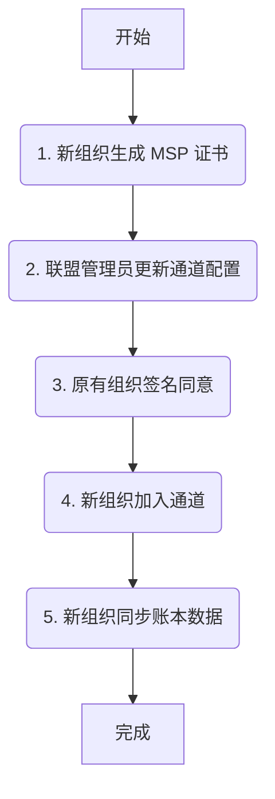
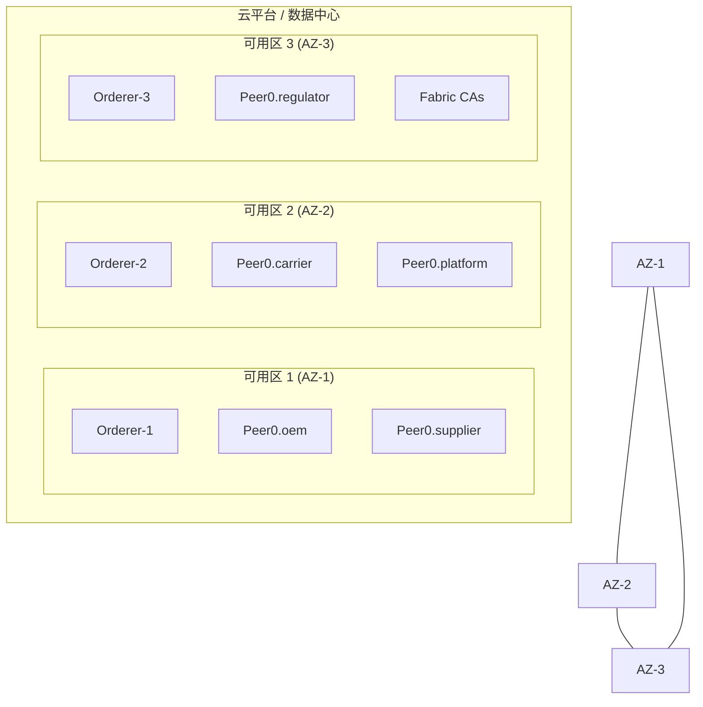

# Fabric 网络拓扑映射 v2.0 (NETWORK-Topology-Mapping-v2.0.md)

> **版本**: 2.1 (含差距分析)
> **更新日期**: 2025-12-26
> **作者**: Aventura

---

## 1. Introduction: 架构愿景

本文档旨在为 Aventura 项目定义一个生产级的 Hyperledger Fabric 网络拓扑。该拓扑基于 MVP1 的经验，以应对未来生产环境的复杂性、安全性和可扩展性要求。

本文将明确区分**当前已实现的 MVP 状态**和 **v2.0 推荐的生产级架构**，并提供清晰的差距分析和升级路径。

**v2.0 核心目标**:
- **身份隔离**: `[v2.0 推荐]` 每个业务实体拥有独立的 MSP，确保信任边界清晰。
- **高性能共识**: `[v2.0 推荐]` 采用 Raft 共识，确保网络高可用和崩溃容错（CFT）。
- **动态扩展**: `[v2.0 推荐]` 支持新组织的无缝加入，不影响现有业务。
- **数据隐私**: `[v2.0 推荐]` 兼顾数据共享与隐私保护，灵活运用多通道与私有数据。

---

## 2. 架构 v2.0 差距分析

下表总结了当前项目实现与 v2.0 拓扑推荐之间的核心差距。

| 模块 | 当前实现 (MVP) | v2.0 推荐 | 主要差距与行动项 |
|---|---|---|---|
| **组织与 MSP** | 3 MSP (Org1, Org2, Org3)，其中承运商与平台方共用 `Org3MSP` | 5 个独立的 MSP | 需为 Carrier 和 Regulator 创建独立 MSP，实现权责分离 |
| **共识机制** | 单节点 Orderer (Solo) | 3+ 节点 Raft 集群，跨可用区部署 | 提升共识层可用性，从 CFT 升级至生产级 CFT |
| **数据隐私** | 所有数据均在公共账本 | **单通道 + 私有数据集合 (PDC)** | **核心差距**：需修改链码，将敏感数据（如价格）移至 PDC |
| **客户端接入** | 直接使用 Fabric SDK | **Fabric Gateway 服务** | 简化客户端逻辑，提升连接管理的健壮性和安全性 |
| **节点扩展** | 手动添加 Peer | **账本快照 (Ledger Snapshot)** | 优化新节点加入流程，从数小时缩短至分钟级 |

---

## 3. MSP & Org Mapping: MSP 与组织映射

### 3.1 组织划分逻辑

- **OEM (主机厂)**: `[已实现]` 核心企业，发起采购订单，拥有最高权限。
- **Supplier (供应商)**: `[已实现]` 原型中为 `Manufacturer`，业务角色一致。
- **Carrier (承运商)**: `[部分实现]` 当前与平台方共用一个 MSP，v2.0 建议独立。
- **Regulator (监管方)**: `[v2.0 推荐]` 新增的业务实体，要求独立的审计权限。
- **Platform (平台方)**: `[已实现]` 维护区块链网络的服务提供方。

### 3.2 组织与 MSP 映射表 `[v2.0 推荐]`

下表定义了 v2.0 架构中推荐的 5 个独立组织的 MSP 映射。

| 组织逻辑名 | MSP ID | 业务角色 | 信任等级 | 备注 |
|---|---|---|---|---|
| OEM | OEMMSP | 主机厂 | 高 | 联盟发起者 |
| Carrier | CarrierMSP | 承运商 | 中 | `[v2.0 新增]` 独立 MSP |
| Regulator | RegulatorMSP| 监管方 | 高 | `[v2.0 新增]` 独立 MSP，负责审计 |
| Supplier | SupplierMSP | 供应商 | 中 | 原 `MANUFACTURER_ORG_MSPID` |
| Platform | PlatformMSP | 服务提供方 | 高 | 负责网络维护和链码部署 |

---

## 4. Node Specification: 节点规范

### 4.1 Peer 节点角色分配 `[v2.0 推荐]`

为了实现职责分离和性能优化，v2.0 架构建议对 Peer 节点进行角色划分。

| Peer 类型 | 角色描述 | 适用组织 | 关键配置 |
|---|---|---|---|
| **Endorsing Peer** | 背书节点 | OEM, Carrier, Supplier | `CORE_PEER_GOSSIP_EXTERNALENDPOINT` |
| **Committing Peer** | 提交节点 | 所有组织的所有 Peer | 所有 Peer 默认均为提交节点 |
| **Anchor Peer** | 锚节点 | 所有组织 | 在通道配置中为每个组织指定一个 Anchor Peer |

### 4.2 Orderer 节点共识方案 `[v2.0 推荐]`

- **共识协议**: Raft
- **节点数量**: 3 (可扩展至 5 或 7)
- **部署建议**: 跨可用区部署，确保高可用性。

**关键配置 (docker-compose.yaml)**:
```yaml
services:
  orderer0.aventura.net.cn:
    container_name: orderer0.aventura.net.cn
    image: hyperledger/fabric-orderer:2.5.6
    # ... 其他配置
```

---

## 5. Scalability & Channel Strategy

### 5.1 新组织加入流程 `[v2.0 推荐]`

v2.0 推荐使用以下标准化流程动态添加新组织成员。


**同步数据优化 `[v2.0 推荐]`**: 新组织 Peer 可优先使用**账本快照（Ledger Snapshot）**快速加入通道，显著缩短同步时间。

### 5.2 隐私设计：私有数据集合 (PDC) 实施方案

在诸如汽车供应链这类多方协作、数据敏感的场景中，**强烈推荐采用单应用通道 + 私有数据集合 (PDC) 的方案**，以实现细粒度的隐私保护。这是 Hyperledger Fabric v2.5 的最佳实践，能够完美平衡数据共享、隐私和审计的需求。

#### 5.2.1 方案概述
PDC 允许在单一通道内，将敏感数据（如价格、合同条款）仅分发给授权组织的 Peer 节点，而链上账本仅记录这些数据的哈希值，用于完整性验证。关键优势在于：
- **数据保密性**：Orderer 节点无法访问私有数据原文，仅负责排序交易哈希。
- **简化管理**：相比为每个隐私场景创建独立通道，PDC 极大地降低了通道膨胀和管理开销（如 MSP、策略、链码的维护）。
- **数据一致性**：所有参与方共享公共状态（如订单 ID、状态），仅隐藏需要保密的商业信息。

#### 5.2.2 PDC 配置推荐 (`collections_config.json`)

基于本文档定义的组织，推荐的 PDC 配置如下：

```json
[
  {
    "name": "coll_oem_supplier",
    "policy": "OR('OEMMSP.member', 'SupplierMSP.member')",
    "requiredPeerCount": 1,
    "maxPeerCount": 2,
    "blockToLive": 0,
    "memberOnlyRead": true,
    "memberOnlyWrite": true,
    "endorsementPolicy": {
      "signaturePolicy": "AND('OEMMSP.peer', 'SupplierMSP.peer')"
    }
  },
  {
    "name": "coll_oem_carrier",
    "policy": "OR('OEMMSP.member', 'CarrierMSP.member')",
    "requiredPeerCount": 1,
    "maxPeerCount": 2,
    "blockToLive": 0,
    "memberOnlyRead": true
  },
  {
    "name": "coll_regulator_audit",
    "policy": "OR('RegulatorMSP.member')",
    "requiredPeerCount": 0,
    "maxPeerCount": 1,
    "blockToLive": 100000,
    "memberOnlyRead": true
  }
]
```

#### 5.2.3 关键设计依据

| 集合名称 | 授权组织 | 典型私有数据示例 | 链上公共状态（哈希） | 逻辑依据 |
|---|---|---|---|---|
| `coll_oem_supplier` | OEM + Supplier | 采购单价格、零部件成本、折扣条款 | 订单 ID、数量、哈希 | 保护核心商业机密；写入操作需双方背书确认。 |
| `coll_oem_carrier` | OEM + Carrier | 运费、详细运输路线、保险细节 | 签收状态、交付时间、哈希 | 物流敏感信息仅限交易双方可见。 |
| `coll_regulator_audit` | Regulator 只读 | 合规报告、质量检测细节（如有） | 仅哈希（监管方可验证完整性） | 满足特定场景下的定向审计需求。 |

#### 5.2.4 数据流示例（采购单场景）

1.  **写入公共状态** (`PutState`): 链码将订单 ID、零部件规格、数量、状态等非敏感数据写入公共账本。
2.  **写入私有数据** (`PutPrivateData`): 同时，链码调用 `PutPrivateData("coll_oem_supplier", key, value)` 将价格、付款条款等敏感数据写入临时交易存储。
3.  **数据分发**: 交易提交后，背书节点通过 Gossip 协议将私有数据点对点地分发给 `coll_oem_supplier` 集合中授权的组织成员（OEM 和 Supplier 的 Peer）。
4.  **验证**: 链码中可使用 `GetPrivateDataHash()` 验证链上哈希与私有数据是否匹配，确保数据未被篡改。

#### 5.2.5 优势与风险评估
- **优势**: 维持单通道的管理便利性，同时提供了强大的字段级隐私保护，易于扩展新成员。
- **风险与缓解**:
  - **数据可用性**: 如果集合中所有 Peer 节点都离线，私有数据可能暂时不可用。**缓解措施**：通过 `requiredPeerCount` 和 `maxPeerCount` 参数，以及冗余的 Peer 节点部署来保证数据高可用。
  - **数据净化**: `blockToLive` 参数设置为 `0` 表示数据永久保存，以满足供应链追溯需求。对于需要定期清除的数据（如 GDPR 合规），可设置具体的块高度。
  - **写入策略**: `collection-level endorsement policy` 可确保私有数据的写入操作必须由指定的组织签名，防止单方面篡改。

---

## 6. 实施建议与风险分析

### 6.1 链码升级与数据迁移

**核心行动项**: 修改 `chaincode/chaincode.go` 以支持 PDC。
- **步骤1**: 定义 `collection-config.json` 文件。
- **步骤2**: 将 `PutState` / `GetState` 调用替换为 `PutPrivateData` / `GetPrivateData` 来处理敏感字段。
- **步骤3**: 考虑历史数据迁移方案（可选，或仅对新数据生效）。

### 6.2 客户端接入建议 `[v2.0 推荐]`
- **建议**: 生产环境优先使用 **Fabric Gateway 服务**，由 Gateway 节点代理背书收集与交易提交，降低客户端复杂度并提升安全性。

---

## 7. v2.0 网络与部署示意图 `[v2.0 推荐]`

以下图表展示了 v2.0 推荐架构的最终形态。

### 7.1 逻辑网络拓扑图

该图展示了五方如何在同一个应用通道中进行交互，并由一个 Raft 集群提供共识服务。

```mermaid
graph TD
    subgraph "Orderer Cluster (Raft)"
        O1[Orderer-1] --- O2[Orderer-2] --- O3[Orderer-3]
    end

    subgraph "Application Channel: supplychain-channel"
        subgraph OEM
            P1[Peer0.oem]
        end
        subgraph Carrier
            P2[Peer0.carrier]
        end
        subgraph Supplier
            P3[Peer0.supplier]
        end
        subgraph Regulator
            P4[Peer0.regulator]
        end
        subgraph Platform
            P5[Peer0.platform]
        end
        
        ClientApp[Client App] -->|Propose Tx (via Fabric Gateway)| P1 & P3
        P1 <-.->|Gossip| P2 & P3 & P4 & P5
        P2 <-.->|Gossip| P3 & P4 & P5
        P3 <-.->|Gossip| P4 & P5
        P4 <-.->|Gossip| P5

        P1 & P2 & P3 & P4 & P5 --o|Submit Endorsed Tx| O1
        O1 -->>|Block Broadcast| P1 & P2 & P3 & P4 & P5
    end
```

### 7.2 物理部署示意图 (跨可用区)

为了保证高可用性，建议将网络节点分散部署在不同的物理服务器或云服务可用区。


---
