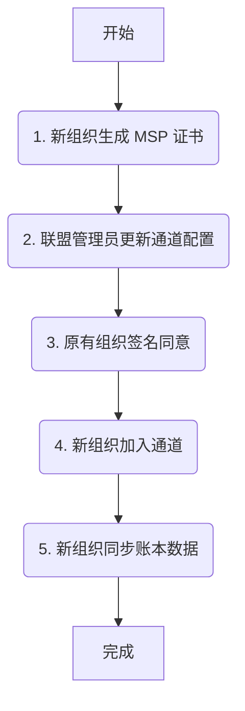
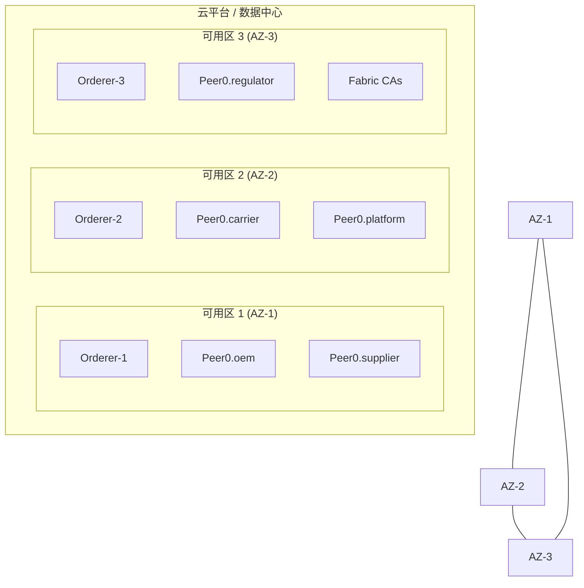

# Fabric 网络拓扑映射 v2.0 (NETWORK-Topology-Mapping-v2.0.md)

> **版本**: 2.0  
> **更新日期**: 2025-12-26  
> **作者**: Aventura

---

## 1. Introduction: 架构愿景

本文档旨在为 Aventura 项目定义一个生产级的 Hyperledger Fabric 网络拓扑。该拓扑基于 MVP1 的经验，以应对未来生产环境的复杂性、安全性和可扩展性要求。

**核心目标**:
- **身份隔离**: 每个业务实体拥有独立的 MSP，确保信任边界清晰。
- **高性能共识**: 采用 Raft 共识（崩溃容错 CFT），提供 leader 选举和快速恢复能力，满足大多数企业级生产需求。
- **动态扩展**: 支持新组织的无缝加入，不影响现有业务。
- **数据隐私**: 兼顾数据共享与隐私保护，灵活运用多通道与私有数据。

---

## 2. MSP & Org Mapping: MSP 与组织映射

### 2.1 组织划分逻辑

- **OEM (主机厂)**: 核心企业，发起采购订单，拥有最高权限。独立 MSP 保证其核心地位。
- **Carrier (承运商)**: 负责物流运输，需要与 OEM 交互运单数据。独立 MSP 确保其物流数据的完整性和所有权。
- **Regulator (监管方)**: 监督供应链流程，需要审计权限。独立 MSP 确保其监管行为的合法性和独立性。
- **Supplier (供应商)**: 提供零部件，需要确认订单和发货。独立 MSP 确保其商业信息的私密性。
- **Platform (平台方)**: 维护区块链网络的服务提供方，负责网络运营和技术支持。

### 2.2 组织与 MSP 映射表

| 组织逻辑名 | MSP ID | 业务角色 | 信任等级 | 备注 |
|---|---|---|---|---|
| OEM | OEMMSP | 主机厂 | 高 | 联盟发起者，拥有通道创世区块创建权 |
| Carrier | CarrierMSP | 承运商 | 中 | 参与运单背书，需与 OEM 共享物流状态 |
| Regulator | RegulatorMSP| 监管方 | 高 | 审计节点，拥有读取所有交易数据的权限 |
| Supplier | SupplierMSP | 供应商 | 中 | 参与订单确认和发货背书 |
| Platform | PlatformMSP | 服务提供方 | 高 | 负责网络维护和链码部署 |

---

## 3. Node Specification: 节点规范

### 3.1 Peer 节点角色分配

| Peer 类型 | 角色描述 | 适用组织 | 关键配置 |
|---|---|---|---|
| **Endorsing Peer** | 背书节点 | OEM, Carrier, Supplier | `CORE_PEER_GOSSIP_EXTERNALENDPOINT` |
| **Committing Peer** | 提交节点 | 所有组织的所有 Peer | 所有 Peer 默认均为提交节点，负责验证并提交区块 |
| **Anchor Peer** | 锚节点 | 所有组织 | 在通道配置中为每个组织指定一个 Anchor Peer |

### 3.2 Orderer 节点共识方案

- **共识协议**: Raft
- **节点数量**: 3 (可扩展至 5 或 7)
- **部署建议**: 跨可用区部署，确保高可用性。

**关键配置 (docker-compose.yaml)**:
```yaml
services:
  orderer0.aventura.net.cn:
    container_name: orderer0.aventura.net.cn
    image: hyperledger/fabric-orderer:2.5.6
    environment:
      - ORDERER_GENERAL_LISTENADDRESS=0.0.0.0
      - ORDERER_GENERAL_LISTENPORT=7050
      - ORDERER_GENERAL_LOCALMSPID=OrdererMSP
      - ORDERER_GENERAL_LOCALMSPDIR=/var/hyperledger/orderer/msp
      # Raft
      - ORDERER_GENERAL_CLUSTER_CLIENTCERTIFICATE=/var/hyperledger/orderer/tls/server.crt
      - ORDERER_GENERAL_CLUSTER_CLIENTPRIVATEKEY=/var/hyperledger/orderer/tls/server.key
      - ORDERER_GENERAL_CLUSTER_ROOTCAS=[/var/hyperledger/orderer/tls/ca.crt]
    ports:
      - 7050:7050
```

---

## 4. Scalability Blueprint: 可扩展性蓝图

### 4.1 新组织加入流程

使用 Mermaid 流程图展示从 4 个 Org 扩展至 N 个 Org 的标准流程:



### 4.2 流程详解

1.  **生成证书**: 新组织（如 `Org5`）使用独立的 CA 生成自己的 MSP 证书和 TLS 证书。
2.  **更新配置**: 联盟管理员（如 `Org1`）获取 `Org5` 的 MSP 信息，并将其添加到通道配置中。
3.  **签名同意**: `Org1` 将更新后的配置提交给其他组织（`Org2`, `Org3`, `Org4`）进行签名。
4.  **加入通道**: 一旦满足通道的修改策略（如，大多数组织同意），新配置生效，`Org5` 正式成为通道成员。
5.  **同步数据**: 新组织 Peer 可优先使用账本快照（Ledger Snapshot）快速加入通道，显著缩短同步时间（从数小时降至分钟）。

### 4.3 通道策略建议：单通道 + 私有数据 (PDC)

对于涉及多方协作、商业数据敏感且需要全程溯源的供应链场景，**强烈推荐采用单应用通道（Single Application Channel） + 私有数据集合（Private Data Collections, PDC）的方案**。这是 Hyperledger Fabric v2.5 在类似场景下的最佳实践。

#### 4.3.1 推荐理由

1.  **满足监管方全审计需求**: 监管方（Regulator）的核心诉求是能够审计完整的交易历史以实现溯源和防篡改。在单通道模型下，所有组织共享同一个账本，监管方能访问所有交易的哈希证据和公共数据，确保了全链条的合规性与数据完整性。
2.  **保障商业核心隐私**: 主机厂与零部件厂之间的采购价格、主机厂与物流商之间的运费等均为敏感商业信息，不希望对联盟内所有成员（包括监管方）公开。PDC 能够完美解决这一问题：
    *   私有数据通过 **Gossip 协议**点对点分发给授权组织。
    *   公共账本上只记录私有数据的 **哈希值**，作为不可篡改的存在性证明。
    *   非授权方无法窥探实际的商业内容，实现了隐私保护与数据审计的平衡。
3.  **简化网络管理与扩展**:
    *   **低管理开销**: 维护单一通道的配置、策略和链码版本远比管理多个通道简单。
    *   **高溯源完整性**: 所有交易都在同一账本，避免了跨通道查询和数据同步的复杂性。
    *   **易于扩展**: 新组织加入时，只需更新单一通道的配置即可，操作简便。

#### 4.3.2 方案对比：单通道 vs. 多通道

| 方面 | 单通道 + PDC (推荐) | 多通道 |
|---|---|---|
| **审计能力** | 监管方可审计全链（哈希 + 公共数据），完整性高 | 监管方需加入所有相关通道，或依赖事件同步，复杂且可能不完整 |
| **隐私粒度** | 细粒度，可精确到单个键值对 | 粗粒度，整个通道的数据被完全隔离 |
| **管理开销** | 低（一个通道、一个链码定义、一套策略） | 高（多个通道配置、多次链码部署、多套策略维护） |
| **溯源完整性** | 非常高（全链条在同一账本） | 中（跨通道溯源需额外开发，逻辑复杂） |
| **适用场景** | 存在审计方且需要部分数据隐私的协作场景（**符合当前案例**） | 业务线完全物理隔离，或组织间无任何信任的场景 |

---

## 5. Risk & Gap Analysis: 风险与差距分析

### 5.1 证书生命周期管理

- **风险**: 证书过期或泄露会导致组织无法参与交易或网络安全受到威胁。
- **建议**:
    - **自动化续期**: 使用 Hyperledger Fabric CA 的 `reenroll` 功能实现证书自动续期。
    - **证书吊销列表 (CRL)**: 定期发布 CRL，及时废除已泄露或无效的证书。

### 5.2 链码包升级策略

- **风险**: 链码升级可能导致业务中断或数据不一致。
- **建议**:
    - **版本控制**: 对链码进行严格的版本控制（如 `v1.0`, `v1.1`, `v2.0`）。
    - **分阶段升级**:
        1.  在开发/测试环境中充分验证新版链码。
        2.  在生产网络中，先在一部分 Peer 节点上安装新版链码。
        3.  通过链码的背书策略，逐步将流量切换到新版链码。
        4.  待所有组织都升级到新版链码后，再更新通道的背书策略。

### 5.3 隐私与性能

- **场景**: 当需要对部分组织（如 OEM 和 Supplier）之间的交易保密，但又不希望创建独立的通道时。
- **建议**: 使用 **私有数据集合 (Private Data Collections, PDC)**。
    - **优势**:
        - **数据隐私**: 私有数据只在授权的组织之间通过 Gossip 协议传播，不写入公共账本。
        - **减少开销**: 与创建新通道相比，PDC 的管理和维护成本更低。
    - **配置示例 (`collection-config.json`)**:
      ```json
      [
        {
          "name": "collectionProcurementPrivate",
          "policy": "OR('OEMMSP.member', 'SupplierMSP.member')",
          "requiredPeerCount": 0,
          "maxPeerCount": 3,
          "blockToLive":1000000,
          "memberOnlyRead": true
        }
      ]
      ```

### 5.4 客户端接入建议
- **建议**: 生产环境优先使用 Fabric Gateway 服务，由一个或多个 Gateway 节点代理背书收集与交易提交，降低客户端复杂度并提升安全性。

---

## 6. Network & Deployment Diagrams

### 6.1 逻辑网络拓扑图

该图展示了五方（OEM, Carrier, Supplier, Regulator, Platform）如何在同一个应用通道中进行交互，并由一个 Raft 集群提供共识服务。

```mermaid
graph TD
    subgraph "Orderer Cluster (Raft)"
        O1[Orderer-1] --- O2[Orderer-2] --- O3[Orderer-3]
    end

    subgraph "Application Channel: supplychain-channel"
        subgraph OEM
            P1[Peer0.oem]
        end
        subgraph Carrier
            P2[Peer0.carrier]
        end
        subgraph Supplier
            P3[Peer0.supplier]
        end
        subgraph Regulator
            P4[Peer0.regulator]
        end
        subgraph Platform
            P5[Peer0.platform]
        end
        
        ClientApp[Client App] -->|Propose Tx (via Fabric Gateway)| P1 & P3
        P1 <-.->|Gossip| P2 & P3 & P4 & P5
        P2 <-.->|Gossip| P3 & P4 & P5
        P3 <-.->|Gossip| P4 & P5
        P4 <-.->|Gossip| P5

        P1 & P2 & P3 & P4 & P5 --o|Submit Endorsed Tx| O1
        O1 -->>|Block Broadcast| P1 & P2 & P3 & P4 & P5
    end
```

### 6.2 物理部署示意图 (跨可用区)

为了保证高可用性，建议将网络节点分散部署在不同的物理服务器或云服务可用区（Availability Zone, AZ）。每个组织可根据资源情况部署多个 Peer（用于高可用性 HA），这里为简化仅展示一个代表节点。


---
