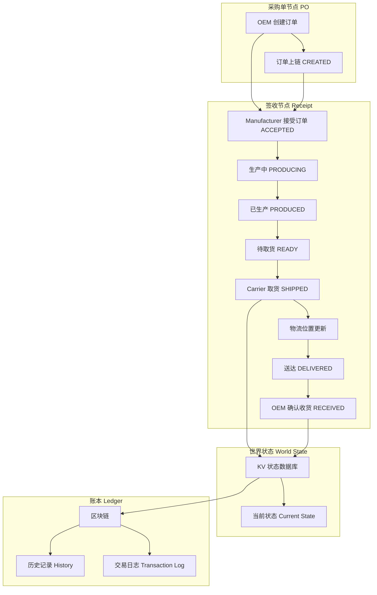
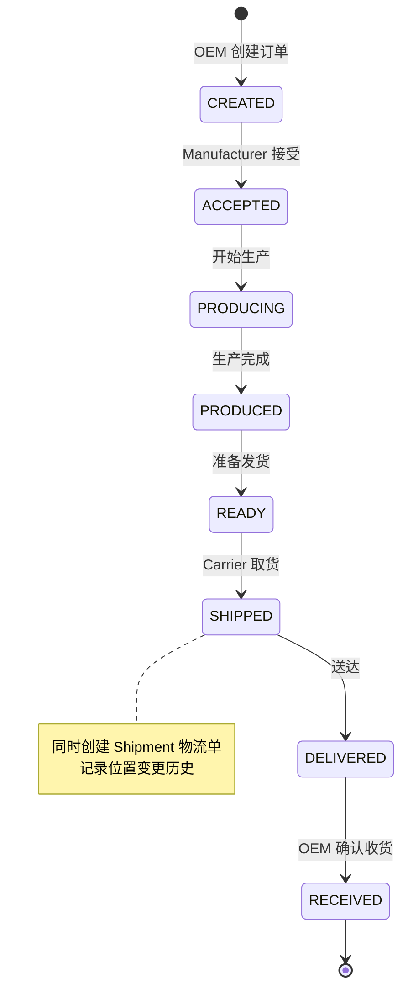

# 汽配供应链协同系统 - 文档中心

> 本文档库为 Hyperledger Fabric 汽配供应链协同系统提供结构化的文档支持，覆盖 **MVP1（采购单→签收→世界状态→账本）** 全链路。

---

## 📊 MVP1 业务流图

### 端到端业务流程



### 状态机流转



---

## 📂 目录结构

```
docs/
├── README.md                         # 文档系统入口（含业务流图）
├── MAPPING-LEDGER.md                 # 文档映射与重构记录表
│
├── core/                             # Core-Logic 核心逻辑文档
│   ├── LOG-CORE-arch-v1.md           # 系统架构与技术栈（39KB）
│   ├── LOG-IMPLEMENTATION-queryall-v1.md  # QueryAllLedgerData 实现总结
│   ├── LOG-LEDGER-history-v1.md      # 账本历史查询详细说明
│   ├── LOG-CALLFLOW-e2e-v1.md        # 端到端调用链路分析
│   ├── LOG-SERVICE-logic-v1.md       # Service 层完整实现逻辑
│   └── LOG-CHANGES-summary-v1.md     # 变更摘要
│
├── guide/                            # Guide 指南文档
│   ├── GDE-README-v1.md              # 项目入口与快速入门
│   ├── GDE-DEVELOPMENT-guide-v1.md   # 二次开发指南
│   ├── GDE-QUERY-comparison-v1.md    # 查询功能对比表
│   ├── GDE-STRUCTURE-v1.md           # 项目结构分析
│   ├── GDE-QUICKSTART-v1.md          # 快速开始指南
│   └── GDE-LOCALDEV-v1.md            # 本地开发环境配置
│
├── ops/                              # Ops 运维文档
│   ├── OPS-BUGFIX-v1.md              # Bug 修复记录
│   ├── OPS-DIAGNOSTIC-fabric-v1.md   # Fabric 网络诊断手册
│   ├── OPS-INSTALL-v1.sh             # 一键部署脚本
│   └── OPS-UNINSTALL-v1.sh           # 一键卸载脚本
│
├── archive/                          # Archive 归档文档（历史/废弃）
│   ├── SPEC-MVP-plan-DEPRECATED.md   # MVP 实施计划（已废弃）
│   ├── SPEC-CHAINCODE-waybill-DEPRECATED.md  # Waybill 链码方案（已废弃）
│   └── SPEC-DOMAIN-change-DRAFT.md   # 域名变更方案（草稿）
│
└── reference/                        # Reference 参考数据
    └── EXAMPLE_RESPONSE.json         # API 响应示例
```

---

## 🚀 快速入口

### 新手推荐阅读顺序

1. **README.md（本文档）** - 业务流图与目录概览
2. **GDE-README-v1.md** - 项目概述与业务流程
3. **GDE-QUICKSTART-v1.md** - 快速开始使用
4. **LOG-CORE-arch-v1.md** - 系统架构深入理解
5. **LOG-CALLFLOW-e2e-v1.md** - 调用链路分析

### 开发者常用

| 需求 | 文档 |
|------|------|
| 二次开发 UI | GDE-DEVELOPMENT-guide-v1.md |
| 后端业务扩展 | LOG-SERVICE-logic-v1.md |
| 链码开发 | LOG-CORE-arch-v1.md |
| API 查询对比 | GDE-QUERY-comparison-v1.md |

### 运维常用

| 需求 | 文档 |
|------|------|
| 部署系统 | OPS-INSTALL-v1.sh |
| 诊断问题 | OPS-DIAGNOSTIC-fabric-v1.md |
| 历史 Bug | OPS-BUGFIX-v1.md |

---

## 📋 文档命名规范

```
[分类码]-[模块名]-[版本号].[扩展名]

分类码:
  LOG- = Logic/Logic Documentation（核心逻辑）
  GDE- = Guide/Guide Documentation（指南）
  OPS- = Operations/Ops Documentation（运维）
  SPC- = Specification/Design Spec（规范）
  REF- = Reference Data（参考数据）

版本号:
  v1 = 初始版本
  v2+ = 重大更新
  DEPRECATED = 已废弃
  DRAFT = 草稿
```

---

## 📈 模块索引

### 1. Core-Logic 模块 (docs/core/)
**用途：** 记录系统核心架构、链码实现、服务层逻辑等不可变的技术事实。

| 文档 | 覆盖内容 | 大小 |
|------|----------|------|
| LOG-CORE-arch-v1.md | 系统架构图、技术栈、API接口、数据模型、部署配置 | 39KB |
| LOG-IMPLEMENTATION-queryall-v1.md | QueryAllLedgerData 功能实现细节 | 7.6KB |
| LOG-LEDGER-history-v1.md | 账本历史查询 API、数据结构、性能考量 | 12KB |
| LOG-CALLFLOW-e2e-v1.md | Vue→API→Service→Chaincode 完整调用链路 | 7.5KB |
| LOG-SERVICE-logic-v1.md | Service 层 MVCC 重试、组织映射、diff 计算 | 9.5KB |
| LOG-CHANGES-summary-v1.md | 功能变更记录与部署步骤 | 8KB |

### 2. Guide 模块 (docs/guide/)
**用途：** 供开发者阅读的教程、指南、参考手册。

| 文档 | 覆盖内容 |
|------|----------|
| GDE-README-v1.md | 项目概述、业务流程、技术栈简介 |
| GDE-DEVELOPMENT-guide-v1.md | UI微调、后端业务调整、数据模型扩展 |
| GDE-QUERY-comparison-v1.md | 各查询功能对比与选型建议 |
| GDE-STRUCTURE-v1.md | 项目目录结构详解 |
| GDE-QUICKSTART-v1.md | API 使用示例、故障排查 |
| GDE-LOCALDEV-v1.md | 本地开发环境搭建 |

### 3. Ops 模块 (docs/ops/)
**用途：** 供运维人员使用的部署脚本、诊断手册、Bug 修复记录。

| 文档 | 覆盖内容 |
|------|----------|
| OPS-INSTALL-v1.sh | 一键部署脚本 |
| OPS-UNINSTALL-v1.sh | 一键卸载脚本 |
| OPS-DIAGNOSTIC-fabric-v1.md | Fabric 网络诊断命令手册 |
| OPS-BUGFIX-v1.md | 历史 Bug 修复记录 |

### 4. Archive 模块 (docs/archive/)
**用途：** 保存历史版本、废弃方案、草稿等参考材料。

| 文档 | 状态 |
|------|------|
| SPEC-MVP-plan-DEPRECATED.md | 已废弃（RealEstate→SupplyChain 转型计划） |
| SPEC-CHAINCODE-waybill-DEPRECATED.md | 已废弃（Waybill 链码设计） |
| SPEC-DOMAIN-change-DRAFT.md | 草稿（域名变更方案） |

---

## 🔗 相关链接

- **项目源码**: `/home/engine/project/`
- **链码**: `chaincode/chaincode.go`
- **后端**: `application/server/`
- **前端**: `application/web/`
- **网络配置**: `network/`

---

**文档版本**: v1.0  
**最后更新**: 2024-12-26  
**重构状态**: ✅ 已完成
