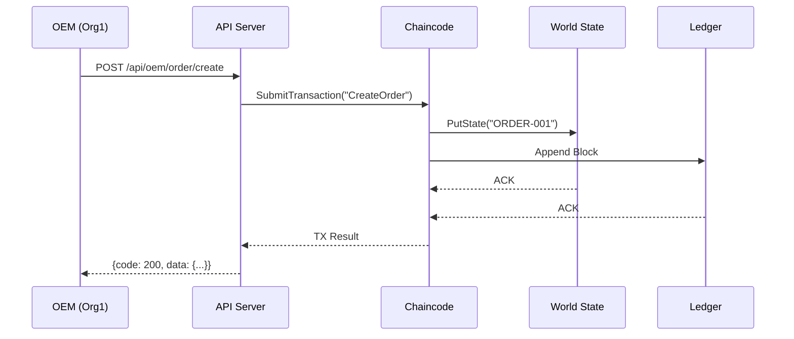

# 📋 重构路线图与缺口分析 (Refactoring Roadmap & Gaps)

---

## 一、重构执行摘要

### 已完成工作

| 任务 | 状态 | 说明 |
|------|------|------|
| 创建 docs/ 目录结构 | ✅ 完成 | 4个子目录：core/guide/archive/reference |
| 文档分类与迁移 | ✅ 完成 | 21个文件已重新组织 |
| 命名规范化 | ✅ 完成 | 采用 `[分类码]-[模块名]-[版本号]` 格式 |
| 文档映射表 | ✅ 完成 | MAPPING-LEDGER.md 记录所有变更 |
| 目录树结构 | ✅ 完成 | README.md 展示完整结构 |
| Mermaid 业务流图 | ✅ 完成 | 集成至 docs/README.md |

---

## 二、合并方案 (Merge Strategies)

### 2.1 Fragment 文档处理

#### Fragment 1: Domain_Change_Plan.md → 归档

**当前状态：** 草稿，仅包含理论分析，未实际执行

**处理方案：** 移至 `docs/archive/SPEC-DOMAIN-change-DRAFT.md`

**合并逻辑：**
- 该文档描述的是"从 example.com 迁移到 aventura.net.cn"的理论方案
- 由于涉及区块链网络重建（需重新生成 MSP 证书），属于高风险操作
- 保留为草稿，供未来参考，但不推荐执行

---

#### Fragment 2: Tasks/UI整改.md → 删除

**当前状态：** 仅有一个标题，无实质内容

**处理方案：** 直接删除

**删除逻辑：**
- 该任务文件无具体内容，无参考价值
- 不属于归档范围（归档保留有历史价值的文档）

---

#### Fragment 3: Tasks/命令行验证账本数据完整性.md → 合并

**当前状态：** 与 diagnostic_manual_final.md 内容高度重复

**处理方案：** 合并至 `docs/ops/OPS-DIAGNOSTIC-fabric-v1.md`

**合并逻辑：**
- 两份文档都是 Fabric CLI 诊断命令手册
- 保留完整版本（diagnostic_manual_final.md），删除Tasks下的重复版本
- 已在迁移过程中完成删除

---

### 2.2 Dead 文档处理

#### Dead 1: MVP_IMPLEMENTATION_PLAN.md → 归档

**当前状态：** 描述 RealEstate→SupplyChain 转型，但业务逻辑已变更

**处理方案：** 移至 `docs/archive/SPEC-MVP-plan-DEPRECATED.md`

**归档逻辑：**
- 记录了项目从房产交易转型到供应链的历史背景
- 对理解项目演进有价值，但不影响当前开发
- 标记为 DEPRECATED，避免误导

---

#### Dead 2: chaincode_implementation_plan.md → 归档

**当前状态：** 描述 Waybill 链码设计，被当前 Order/Shipment 模型替代

**处理方案：** 移至 `docs/archive/SPEC-CHAINCODE-waybill-DEPRECATED.md`

**归档逻辑：**
- 记录了 MVP2 阶段的设计演进
- 当前链码已采用 Order/Shipment 双资产模型
- 保留为历史参考，标记为 DEPRECATED

---

## 三、缺口分析与补全建议 (Gaps & Debt)

### 3.1 MVP1 节点覆盖度分析

| MVP1 节点 | 当前覆盖度 | 缺口文档 | 建议补全 |
|-----------|-----------|----------|----------|
| **采购单 (PO)** | ✅ 100% | 无 | 已覆盖 |
| **签收 (Receipt)** | ✅ 100% | 无 | 已覆盖 |
| **世界状态 (World State)** | ⚠️ 60% | **LOG-CONCEPT-worldstate-v1.md** | **需新建** |
| **账本 (Ledger)** | ✅ 100% | 无 | 已覆盖 |

---

### 3.2 World State 概念文档缺失

**缺口描述：** 当前文档中有提及 World State 的概念（如在 LEDGER_HISTORY_QUERY.md 和诊断手册中），但缺少专门解释 World State vs Ledger 区别的文档。

**推荐文档结构：**

```markdown
# LOG-CONCEPT-worldstate-v1.md

## 1. World State 概念

### 1.1 定义
- World State 是 Fabric 的键值存储（KV Store）
- 存储当前最新的资产状态
- 类似传统数据库的当前数据视图

### 1.2 与 Ledger 的区别
| 特性 | World State | Ledger |
|------|-------------|--------|
| 数据类型 | 最新状态（Current State） | 完整历史（History） |
| 数据结构 | Key-Value | 区块链表 |
| 查询速度 | 快（O(1)） | 慢（需遍历） |
| 更新频率 | 每次交易 | 只增不减 |

### 1.3 核心 API
- `PutState(key, value)` - 写入状态
- `GetState(key)` - 读取状态
- `GetStateByRange(startKey, endKey)` - 范围查询
- `GetStateByPartialCompositeKey(...)` - 复合键查询
```

---

### 3.3 端到端时序图缺失

**缺口描述：** 当前只有调用链路分析（LOG-CALLFLOW-e2e-v1.md），缺少 MVP1 端到端的时序图（Sequence Diagram）。

**建议：** 新建 `LOG-SEQUENCE-mvp1-v1.md`，包含：



---

### 3.4 状态机约束说明缺失

**缺口描述：** 当前状态机定义分散在多个文档中，缺少统一的状态流转约束说明。

**建议：** 扩展 LOG-CORE-arch-v1.md 或新建 `LOG-STATEMACHINE-v1.md`，包含：

- 状态流转前置条件
- 角色权限约束（如：仅 OEM 可调用 ConfirmReceipt）
- 异常状态处理（超时、取消等）

---

### 3.5 链码 API 文档不完整

**缺口描述：** TECHNICAL_DOCUMENTATION.md 包含部分链码 API，但不够完整。

**建议：** 新建 `LOG-CHAINCODE-api-v1.md`，完整记录：
- 所有合约方法签名
- 参数说明
- 返回值格式
- 权限要求
- 错误码定义

---

## 四、推荐新增文档清单

| 优先级 | 文档 | 路径 | 说明 |
|--------|------|------|------|
| **P0** | LOG-CONCEPT-worldstate-v1.md | docs/core/ | World State 概念说明（解决当前缺口） |
| **P1** | LOG-SEQUENCE-mvp1-v1.md | docs/core/ | MVP1 端到端时序图 |
| **P1** | LOG-STATEMACHINE-v1.md | docs/core/ | 状态机流转约束 |
| **P2** | LOG-CHAINCODE-api-v1.md | docs/core/ | 完整链码 API 文档 |
| **P2** | GDE-ARCH-diagram-v1.md | docs/guide/ | 架构图集（多视图） |

---

## 五、执行路线图

### Phase 1: 基础设施完善（本周）

| 任务 | 负责人 | 交付物 |
|------|--------|--------|
| 创建 docs/ 目录结构 | ✅ 已完成 | docs/core/guide/archive/reference |
| 迁移现有文档 | ✅ 已完成 | 21个文件重新组织 |
| 创建 MAPPING-LEDGER.md | ✅ 已完成 | 文档映射表 |

### Phase 2: 核心文档补全（1-2周）

| 任务 | 优先级 | 交付物 | 逻辑依据 |
|------|--------|--------|----------|
| 编写 World State 概念文档 | P0 | LOG-CONCEPT-worldstate-v1.md | 解决 MVP1 节点覆盖缺口 |
| 编写 MVP1 时序图 | P1 | LOG-SEQUENCE-mvp1-v1.md | 增强架构理解 |
| 编写状态机约束文档 | P1 | LOG-STATEMACHINE-v1.md | 统一业务规则 |

### Phase 3: 运维文档完善（持续）

| 任务 | 优先级 | 交付物 |
|------|--------|--------|
| 补充部署检查清单 | P2 | OPS-CHECKLIST-v1.md |
| 补充故障处理手册 | P2 | OPS-TROUBLESHOOT-v1.md |

---

## 六、风险与依赖

### 风险

| 风险 | 影响 | 缓解措施 |
|------|------|----------|
| 文档与代码不同步 | 误导开发者 | 建立文档与代码的关联注释 |
| 新增文档质量不达标 | 降低可用性 | 制定文档模板和质量检查清单 |

### 依赖

| 依赖项 | 状态 | 说明 |
|--------|------|------|
| World State 概念澄清 | 需架构师确认 | 避免概念错误 |
| MVP1 时序图验证 | 需产品确认 | 确保流程正确 |

---

## 七、成功指标

| 指标 | 目标值 | 测量方式 |
|------|--------|----------|
| 文档覆盖度 | ≥95% | MVP1 4个节点全部覆盖 |
| 文档命名规范率 | 100% | 所有文档符合 `[分类码]-[模块名]-[版本号]` |
| 目录深度 | ≤3层 | 结构树深度检查 |
| 文档可读性 | 清晰易懂 | 代码Review反馈 |

---

**文档版本**: v1.0  
**创建日期**: 2024-12-26  
**下一步**: Phase 2 核心文档补全
