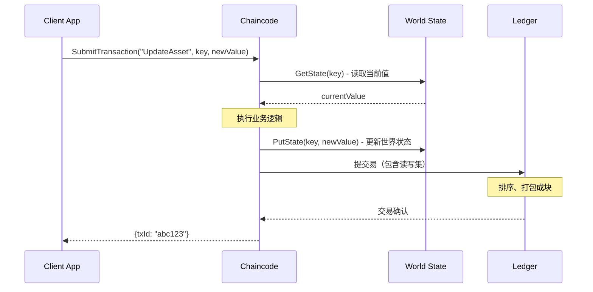

# World State vs Ledger 概念说明

> 文档版本: v1.0
> 更新日期: 2024-12-26
> 分类码: LOG-CONCEPT-worldstate-v1.md

---

## 📋 概述

本文档详细阐述 Hyperledger Fabric 中 World State（世界状态）与 Ledger（账本）的核心概念、区别及使用场景，帮助开发者正确理解 Fabric 的数据存储架构。

---

## 1. World State（世界状态）

### 1.1 定义

World State 是 Fabric 的键值存储（KV Store），用于存储资产（Assets）的**当前最新状态**。

**特性：**
- 以键值对（Key-Value）形式存储
- 只保留每个资产的最新版本
- 可快速查询和更新
- 支持复杂查询（CouchDB 时支持富查询）

### 1.2 核心用途

World State 类似传统数据库的当前数据视图，主要用于：
- **快速查询资产状态** - 无需遍历区块链即可获取最新值
- **业务逻辑判断** - 基于当前状态决定后续操作
- **范围查询** - GetStateByRange、GetStateByPartialCompositeKey
- **分页查询** - GetStateByRangeWithPagination

### 1.3 核心 API

| API | 用途 | 返回值 |
|-----|------|--------|
| `PutState(key, value)` | 写入/更新状态 | error |
| `GetState(key)` | 读取单个资产状态 | (value, error) |
| `GetStateByRange(startKey, endKey)` | 范围查询所有资产 | StateQueryIterator |
| `GetStateByPartialCompositeKey(objectType, attributes)` | 复合键部分匹配查询 | StateQueryIterator |
| `GetStateByRangeWithPagination(startKey, endKey, pageSize, bookmark)` | 分页范围查询 | (StateQueryIterator, responseMetadata, error) |

### 1.4 World State 限制

- **仅存储最新状态** - 无法直接查询历史版本
- **可更新** - 同一个 key 可以被多次 PutState 覆盖
- **基于通道** - 每个通道有独立的 World State

---

## 2. Ledger（账本）

### 2.1 定义

Ledger 是 Fabric 的区块链，以**只追加（append-only）**的方式记录所有交易历史。

**特性：**
- 区块链结构，按时间顺序存储交易
- 每个区块包含多个交易
- **不可篡改** - 一旦写入，无法修改或删除
- **完整历史** - 保存所有状态的变更轨迹

### 2.2 区块结构

```
Block #N
├── Header
│   ├── Number: 区块高度
│   ├── PreviousHash: 上一区块哈希
│   └── DataHash: 区块数据哈希
└── Data
    └── Transactions[]
        ├── Transaction 1
        │   ├── Header: 交易ID、时间戳、签名
        │   ├── Actions: 读写集（RWSet）
        │   └── Metadata: 提交者、提交时间
        ├── Transaction 2
        └── ...
```

### 2.3 核心 API

| API | 用途 | 返回值 |
|-----|------|--------|
| `GetHistoryForKey(key)` | 查询单个资产的完整历史 | HistoryQueryIterator |
| `GetBlockByNumber(blockNumber)` | 按区块号获取区块 | (*Block, error) |
| `GetTransactionByID(txId)` | 按交易ID获取交易 | (*ProcessedTransaction, error) |

### 2.4 Ledger 优势

- **不可篡改性** - 所有变更记录在链，审计可信
- **完整追溯** - GetHistoryForKey 可查询任意历史版本
- **交易原子性** - 每个交易的读写集保证一致性

---

## 3. World State vs Ledger 对比

| 维度 | World State | Ledger |
|------|-------------|--------|
| **数据类型** | 最新状态（Current State） | 完整历史（History） |
| **数据结构** | Key-Value | 区块链列表（Block Chain） |
| **更新方式** | 可覆盖写入 | 只追加（Append-Only） |
| **查询速度** | 快（O(1) 直接寻址） | 慢（需遍历区块或历史记录） |
| **存储位置** | LevelDB/CouchDB | 区块文件 |
| **主要用途** | 业务查询、状态判断 | 审计、追溯、合规 |
| **持久化** | 定期快照（Snapshot） | 持久化区块文件 |

---

## 4. 数据流转机制

### 4.1 写入流程



**读写集（RWSet）：**
```
ReadSet:  [key="ORDER-001"]
WriteSet: [key="ORDER-001", value={...new state...}]
```

### 4.2 查询流程

**场景 1：查询当前状态**
```
Chaincode → GetState("ORDER-001") → World State → 返回最新值
```

**场景 2：查询历史状态**
```
Chaincode → GetHistoryForKey("ORDER-001") → Ledger 遍历区块 → 返回历史记录数组
```

---

## 5. MVP1 中的应用场景

### 5.1 World State 使用场景

| 功能 | API | 示例 |
|------|-----|------|
| 查询订单当前状态 | `GetState("ORDER-001")` | 判断订单是否可签收 |
| 分页查询所有订单 | `GetStateByRangeWithPagination()` | Platform 端全链路查询 |
| 查询待取货订单 | `GetStateByPartialCompositeKey("ORDER", ["READY"])` | Carrier 批量获取待取货列表 |
| 更新订单状态 | `PutState("ORDER-001", newState)` | 更新为 SHIPPED |

### 5.2 Ledger 使用场景

| 功能 | API | 示例 |
|------|-----|------|
| 完整历史追溯 | `GetHistoryForKey("ORDER-001")` | QueryAllLedgerData 功能 |
| 审计某时间点数据 | 遍历 History | 合规审计 |
| 交易回溯 | `GetTransactionByID(txId)` | 查询某次变更的详细信息 |
| 区块完整性校验 | `GetBlockByNumber()` | 运维诊断 |

---

## 6. 常见问题

### Q1: World State 数据丢失怎么办？

**A:** World State 数据可以从 Ledger 重建。Fabric 提供 `state snapshot` 功能，也可以通过重放所有区块的交易来重建 World State。

### Q2: 为什么需要 GetHistoryForKey？

**A:** World State 只保留最新状态，历史查询（如：订单何时从 CREATED 变为 ACCEPTED）必须通过 Ledger 的历史记录实现。

### Q3: CouchDB vs LevelDB 选择？

**A:**
- **LevelDB**：仅支持简单键值查询（GetState、GetStateByRange）
- **CouchDB**：支持富查询（Mango Query），可按任意字段过滤

本项目使用 **LevelDB**，主要查询场景为按 Key 范围或复合键查询。

### Q4: GetHistoryForKey 性能如何？

**A:** GetHistoryForKey 需要遍历区块中的历史记录，性能与历史长度线性相关。
- **建议**：避免在频繁业务调用中使用，主要用于审计和报表场景
- **优化**：QueryAllLedgerData 功能已实现分页，避免一次性查询所有资产

---

## 7. 代码示例

### 7.1 World State 查询（当前状态）

```go
// chaincode/chaincode.go
func (s *SmartContract) QueryOrder(ctx contractapi.TransactionContextInterface, orderID string) (*Order, error) {
    // 从 World State 读取最新状态
    orderBytes, err := ctx.GetStub().GetState(orderID)
    if err != nil {
        return nil, fmt.Errorf("failed to read from world state: %v", err)
    }
    if orderBytes == nil {
        return nil, fmt.Errorf("order %s does not exist", orderID)
    }

    var order Order
    json.Unmarshal(orderBytes, &order)
    return &order, nil
}
```

### 7.2 Ledger 查询（历史状态）

```go
// chaincode/chaincode.go
func (s *SmartContract) GetOrderHistory(ctx contractapi.TransactionContextInterface, orderID string) ([]HistoryQueryResult, error) {
    // 从 Ledger 读取历史记录
    historyIterator, err := ctx.GetStub().GetHistoryForKey(orderID)
    if err != nil {
        return nil, fmt.Errorf("failed to get history: %v", err)
    }
    defer historyIterator.Close()

    var results []HistoryQueryResult
    for historyIterator.HasNext() {
        historyData, err := historyIterator.Next()
        if err != nil {
            return nil, err
        }

        var order Order
        if !historyData.IsDelete {
            json.Unmarshal(historyData.Value, &order)
        }

        results = append(results, HistoryQueryResult{
            TxId:      historyData.TxId,
            Timestamp: time.Unix(historyData.Timestamp.Seconds, int64(historyData.Timestamp.Nanos)),
            IsDelete:  historyData.IsDelete,
            Record:    order,
        })
    }

    return results, nil
}
```

---

## 8. 相关文档

- **LOG-LEDGER-history-v1.md** - 账本历史查询功能详解
- **LOG-CALLFLOW-e2e-v1.md** - 端到端调用链路分析
- **LOG-CORE-arch-v1.md** - 系统架构与技术栈

---

**文档版本**: v1.0
**创建日期**: 2024-12-26
**维护者**: 架构组
