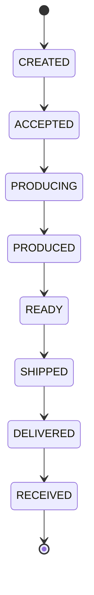

# 数据字典 (Data Dictionary)

> **文档版本**: v1.0  
> **更新日期**: 2024-12-26  
> **分类**: Core-Logic (LOG-)

---

## 概述

本文档记录系统中所有核心数据实体的完整定义，包括字段说明、数据类型、取值范围及业务约束。所有数据结构在链码层 (Go) 和前端层 (TypeScript) 保持一致。

---

## 资产类型常量

| 常量名 | 值 | 描述 | 位置 |
|--------|-----|------|------|
| `ORDER` | `"ORDER"` | 采购订单资产 | chaincode |
| `SHIPMENT` | `"SHIPMENT"` | 物流信息资产 | chaincode |

---

## 订单 (Order)

### Go 定义 (chaincode/chaincode.go)

```go
type Order struct {
    ID             string      `json:"id"`             // 订单ID
    ObjectType     string      `json:"objectType"`     // 资产类型 (ORDER)
    OEMID          string      `json:"oemId"`          // 主机厂组织 ID
    ManufacturerID string      `json:"manufacturerId"` // 零部件厂商 ID
    Items          []OrderItem `json:"items"`          // 零件清单
    Status         OrderStatus `json:"status"`         // 当前状态
    TotalPrice     float64     `json:"totalPrice"`     // 总价
    ShipmentID     string      `json:"shipmentId"`     // 关联物流单ID
    CreateTime     time.Time   `json:"createTime"`     // 创建时间
    UpdateTime     time.Time   `json:"updateTime"`     // 更新时间
}
```

### TypeScript 定义 (application/web/src/types/index.ts)

```typescript
export interface Order {
  id: string;
  oemId: string;
  manufacturerId: string;
  items: OrderItem[];
  status: OrderStatus;
  totalPrice: number;
  shipmentId: string;
  createTime: string;
  updateTime: string;
}
```

### 字段详情

| 字段 | 类型 | 必填 | 描述 | 约束 |
|------|------|------|------|------|
| `id` | string | ✅ | 订单唯一标识 | 格式: `ORDER-XXX` |
| `objectType` | string | ✅ | 资产类型标识 | 固定值: `"ORDER"` |
| `oemId` | string | ✅ | 主机厂组织 ID | 对应 Org1MSP |
| `manufacturerId` | string | ✅ | 零部件厂商 ID | 对应 Org2MSP |
| `items` | OrderItem[] | ✅ | 零件明细列表 | 至少 1 个 item |
| `status` | OrderStatus | ✅ | 订单当前状态 | 见状态枚举 |
| `totalPrice` | float64 | ✅ | 订单总金额 | ≥ 0 |
| `shipmentId` | string | ❌ | 关联物流单 ID | 取货后填充 |
| `createTime` | time.Time | ✅ | 订单创建时间 | 自动生成 |
| `updateTime` | time.Time | ✅ | 最后更新时间 | 自动更新 |

---

## 订单零件明细 (OrderItem)

### Go 定义

```go
type OrderItem struct {
    Name     string  `json:"name"`     // 零件名称
    Quantity int     `json:"quantity"` // 数量
    Price    float64 `json:"price"`    // 单价
}
```

### TypeScript 定义

```typescript
export interface OrderItem {
  name: string;
  quantity: number;
  price: number;
}
```

### 字段详情

| 字段 | 类型 | 必填 | 描述 | 约束 |
|------|------|------|------|------|
| `name` | string | ✅ | 零件名称 | 非空字符串 |
| `quantity` | int | ✅ | 采购数量 | > 0 |
| `price` | float64 | ✅ | 单价 | ≥ 0 |

---

## 订单状态枚举 (OrderStatus)

### Go 定义

```go
type OrderStatus string

const (
    ORDER_CREATED   OrderStatus = "CREATED"   // 主机厂已发布
    ORDER_ACCEPTED  OrderStatus = "ACCEPTED"  // 零部件厂已接受
    ORDER_PRODUCING OrderStatus = "PRODUCING" // 生产中
    ORDER_PRODUCED  OrderStatus = "PRODUCED"  // 生产完成
    ORDER_READY     OrderStatus = "READY"     // 待取货
    ORDER_SHIPPED   OrderStatus = "SHIPPED"   // 运输中
    ORDER_DELIVERED OrderStatus = "DELIVERED" // 已送达
    ORDER_RECEIVED  OrderStatus = "RECEIVED"  // 已签收确认
)
```

### TypeScript 定义

```typescript
export type OrderStatus = 'CREATED' | 'ACCEPTED' | 'PRODUCING' | 'PRODUCED' | 'READY' | 'SHIPPED' | 'DELIVERED' | 'RECEIVED';
```

### 状态流转图



---

## 物流单 (Shipment)

### Go 定义 (chaincode/chaincode.go)

```go
type Shipment struct {
    ID         string    `json:"id"`         // 物流单ID
    ObjectType string    `json:"objectType"` // 资产类型 (SHIPMENT)
    OrderID    string    `json:"orderId"`    // 关联订单ID
    CarrierID  string    `json:"carrierId"`  // 承运商 ID
    Location   string    `json:"location"`   // 当前位置
    Status     string    `json:"status"`     // 运输状态
    UpdateTime time.Time `json:"updateTime"` // 更新时间
}
```

### TypeScript 定义 (application/web/src/types/index.ts)

```typescript
export interface Shipment {
  id: string;
  orderId: string;
  carrierId: string;
  location: string;
  status: string;
  updateTime: string;
}
```

### 字段详情

| 字段 | 类型 | 必填 | 描述 | 约束 |
|------|------|------|------|------|
| `id` | string | ✅ | 物流单唯一标识 | 格式: `SHIPMENT-XXX` |
| `objectType` | string | ✅ | 资产类型标识 | 固定值: `"SHIPMENT"` |
| `orderId` | string | ✅ | 关联订单 ID | 必须存在 |
| `carrierId` | string | ✅ | 承运商组织 ID | 对应 Org3MSP |
| `location` | string | ❌ | 当前物流位置 | 取货后填充 |
| `status` | string | ✅ | 运输状态 | `CREATED` / `IN_TRANSIT` |
| `updateTime` | time.Time | ✅ | 最后更新时间 | 自动更新 |

---

## 组织常量

### MSP ID 常量

| 常量名 | 值 | 描述 | 对应业务角色 |
|--------|-----|------|--------------|
| `OEM_ORG_MSPID` | `"Org1MSP"` | 主机厂组织 | OEM |
| `MANUFACTURER_ORG_MSPID` | `"Org2MSP"` | 零部件厂商组织 | Manufacturer |
| `PLATFORM_ORG_MSPID` | `"Org3MSP"` | 平台方/承运商组织 | Carrier / Platform |

### 组织与角色映射

| 物理组织 | MSP ID | 业务角色 | 描述 |
|----------|--------|----------|------|
| Org1 | Org1MSP | OEM (主机厂) | 创建订单、签收确认 |
| Org2 | Org2MSP | Manufacturer (零部件厂) | 接受订单、更新生产状态 |
| Org3 | Org3MSP | Carrier (承运商) | 取货、更新位置 |
| Org3 | Org3MSP | Platform (平台) | 全链路查询、监管 |

---

## API 响应结构

### 统一响应格式

```typescript
export interface ApiResponse<T = any> {
  code: number;      // 状态码: 200=成功
  message: string;   // 状态消息
  data?: T;          // 响应数据
}
```

### 分页结果结构

```typescript
export interface SupplyChainPageResult<T> {
  records: T[];              // 记录列表
  bookmark: string;          // 分页书签 (下一页标识)
  recordsCount: number;      // 总记录数
  fetchedRecordsCount: number; // 本次获取记录数
}
```

### 历史记录结构

```typescript
export interface DiffDetail {
  old: any;   // 旧值
  new: any;   // 新值
}

export interface HistoryRecord {
  txId: string;       // 交易 ID
  timestamp: string;  // 交易时间
  isDelete: boolean;  // 是否删除
  value: any;         // 状态值
  diff: Record<string, DiffDetail>; // 字段变更差异
}
```

---

## 数据一致性规则

1. **Order 与 Shipment 关联**
   - 一个 Order 只能关联一个 Shipment
   - Shipment 创建时必须指定关联的 Order ID
   - Order 的 `shipmentId` 在取货后填充

2. **状态约束**
   - 只有 `READY` 状态的 Order 可以执行取货操作
   - 只有 `IN_TRANSIT` 状态的 Order 可以执行签收操作

3. **权限约束**
   - Order 创建者 (OEM) 可以执行签收
   - Manufacturer 可以接受并更新其接收的 Order
   - Carrier 可以更新其承接的 Shipment 位置
