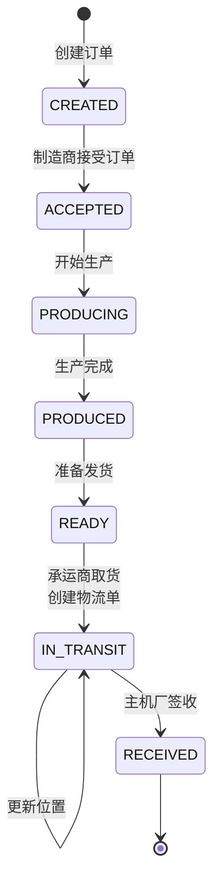

# 订单状态机 (Order State Machine)

> **文档版本**: v1.0  
> **更新日期**: 2024-12-26  
> **分类**: Core-Logic (LOG-)

---

## 概述

本文档描述 MVP1 采购单的完整状态机设计，涵盖从订单创建到签收的全生命周期状态流转。

## 状态定义

### 订单状态 (Order Status)

| 状态 | 常量值 | 描述 | 可执行操作 |
|------|--------|------|------------|
| **CREATED** | `"CREATED"` | 订单已创建，等待制造商接受 | 接受订单 |
| **ACCEPTED** | `"ACCEPTED"` | 制造商已接受订单 | 开始生产 |
| **PRODUCING** | `"PRODUCING"` | 生产中 | 生产完成 |
| **PRODUCED** | `"PRODUCED"` | 生产完成 | 准备发货 |
| **READY** | `"READY"` | 准备发货，等待承运商取货 | 取货 |
| **IN_TRANSIT** | `"IN_TRANSIT"` | 物流运输中 | 更新位置 |
| **RECEIVED** | `"RECEIVED"` | 主机厂已签收 | 订单完成 |

### 物流单状态 (Shipment Status)

| 状态 | 常量值 | 描述 |
|------|--------|------|
| **CREATED** | `"CREATED"` | 物流单已创建 |
| **IN_TRANSIT** | `"IN_TRANSIT"` | 运输中 |

---

## 状态机图示



---

## 状态流转详情

### 1. CREATED → ACCEPTED

**触发条件**: 制造商调用 `AcceptOrder`

**业务含义**: 零部件厂商确认接收该采购订单

**链码逻辑**:
```go
func (s *SmartContract) AcceptOrder(ctx contractapi.TransactionContextInterface, id string) error {
    order, err := s.QueryOrder(ctx, id)
    if order.Status != "CREATED" {
        return fmt.Errorf("订单状态不是 CREATED，无法接受")
    }
    order.Status = "ACCEPTED"
    order.AcceptedTime = time.Now()
    return s.SaveOrder(ctx, order)
}
```

**权限**: 仅 Manufacturer Org (Org2) 可执行

---

### 2. ACCEPTED → PRODUCING

**触发条件**: 制造商调用 `UpdateProductionStatus` 设置为 `"PRODUCING"`

**业务含义**: 开始实际生产工作

**权限**: 仅 Manufacturer Org (Org2) 可执行

---

### 3. PRODUCING → PRODUCED

**触发条件**: 制造商调用 `UpdateProductionStatus` 设置为 `"PRODUCED"`

**业务含义**: 生产已完成，准备发货

**权限**: 仅 Manufacturer Org (Org2) 可执行

---

### 4. PRODUCED → READY

**触发条件**: 制造商调用 `UpdateProductionStatus` 设置为 `"READY"`

**业务含义**: 货物已打包完成，等待承运商取货

**权限**: 仅 Manufacturer Org (Org2) 可执行

---

### 5. READY → IN_TRANSIT

**触发条件**: 承运商调用 `PickupGoods`

**业务含义**: 
- 承运商取走货物
- 创建物流单 (Shipment)
- 订单状态变为 `IN_TRANSIT`

**链码逻辑**:
```go
func (s *SmartContract) PickupGoods(ctx contractapi.TransactionContextInterface, orderId, shipmentId string) error {
    order, err := s.QueryOrder(ctx, orderId)
    if order.Status != "READY" {
        return fmt.Errorf("订单状态不是 READY，无法取货")
    }
    order.Status = "IN_TRANSIT"
    
    shipment := Shipment{
        ID:         shipmentId,
        OrderID:    orderId,
        Status:     "IN_TRANSIT",
        PickupTime: time.Now(),
    }
    
    if err := s.SaveOrder(ctx, order); err != nil { return err }
    return s.SaveShipment(ctx, shipment)
}
```

**权限**: 仅 Carrier Org (Org3) 可执行

---

### 6. IN_TRANSIT → IN_TRANSIT (多次)

**触发条件**: 承运商调用 `UpdateLocation`

**业务含义**: 实时更新货物位置信息

**链码逻辑**:
```go
func (s *SmartContract) UpdateLocation(ctx contractapi.TransactionContextInterface, id, location string) error {
    shipment, err := s.QueryShipment(ctx, id)
    shipment.Location = location
    shipment.LocationHistory = append(shipment.LocationHistory, LocationRecord{
        Location: location,
        Timestamp: time.Now(),
    })
    return s.SaveShipment(ctx, shipment)
}
```

**权限**: 仅 Carrier Org (Org3) 可执行

---

### 7. IN_TRANSIT → RECEIVED

**触发条件**: 主机厂调用 `ConfirmReceipt`

**业务含义**: 货物已送达并签收，订单闭环

**链码逻辑**:
```go
func (s *SmartContract) ConfirmReceipt(ctx contractapi.TransactionContextInterface, id string) error {
    order, err := s.QueryOrder(ctx, id)
    if order.Status != "IN_TRANSIT" {
        return fmt.Errorf("订单不在运输中，无法签收")
    }
    order.Status = "RECEIVED"
    order.ReceivedTime = time.Now()
    return s.SaveOrder(ctx, order)
}
```

**权限**: 仅 OEM Org (Org1) 可执行

---

## 权限矩阵

| 操作 | OEM (Org1) | Manufacturer (Org2) | Carrier (Org3) |
|------|------------|---------------------|----------------|
| CreateOrder | ✅ | ❌ | ❌ |
| AcceptOrder | ❌ | ✅ | ❌ |
| UpdateProductionStatus | ❌ | ✅ | ❌ |
| PickupGoods | ❌ | ❌ | ✅ |
| UpdateLocation | ❌ | ❌ | ✅ |
| ConfirmReceipt | ✅ | ❌ | ❌ |
| QueryOrder | ✅ | ✅ | ✅ |
| QueryOrderHistory | ✅ | ✅ | ✅ |

---

## 数据结构

### Order 结构

```go
type Order struct {
    ObjectType       string    `json:"objectType"`
    ID               string    `json:"id"`
    ManufacturerID   string    `json:"manufacturerId"`
    Items            []Item    `json:"items"`
    Status           string    `json:"status"`
    CreatedTime      time.Time `json:"createdTime"`
    AcceptedTime     time.Time `json:"acceptedTime"`
    ProducedTime     time.Time `json:"producedTime"`
    ReadyTime        time.Time `json:"readyTime"`
    ReceivedTime     time.Time `json:"receivedTime"`
}
```

### Shipment 结构

```go
type Shipment struct {
    ObjectType       string          `json:"objectType"`
    ID               string          `json:"id"`
    OrderID          string          `json:"orderId"`
    Location         string          `json:"location"`
    LocationHistory  []LocationRecord `json:"locationHistory"`
    Status           string          `json:"status"`
    PickupTime       time.Time       `json:"pickupTime"`
}
```

---

## 审计追踪

所有状态变更都会记录到区块链账本，可通过 `QueryOrderHistory` API 查询完整历史：

```bash
curl "http://localhost:8000/api/oem/order/ORDER-001/history"
```

返回示例:
```json
{
  "code": 200,
  "data": [
    {
      "txId": "abc123...",
      "timestamp": "2024-12-26T10:00:00Z",
      "status": "RECEIVED",
      "diff": {
        "status": {"old": "IN_TRANSIT", "new": "RECEIVED"}
      }
    },
    {
      "txId": "def456...",
      "timestamp": "2024-12-26T09:00:00Z",
      "status": "IN_TRANSIT",
      "diff": {
        "status": {"old": "READY", "new": "IN_TRANSIT"}
      }
    }
  ]
}
```
