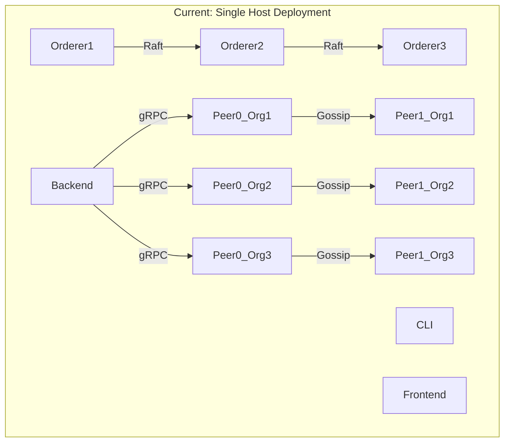
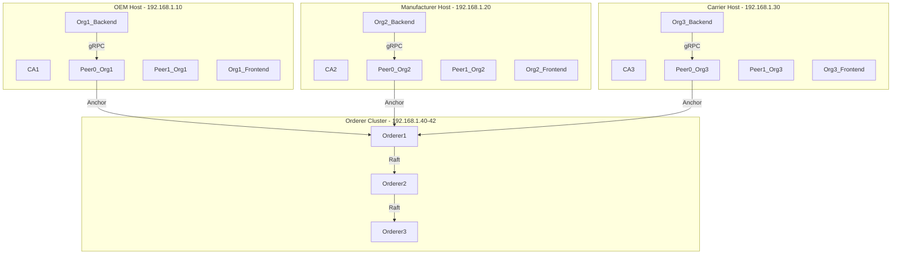
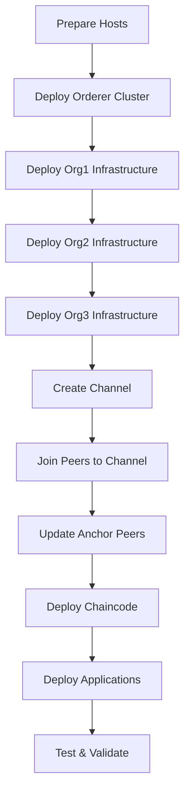
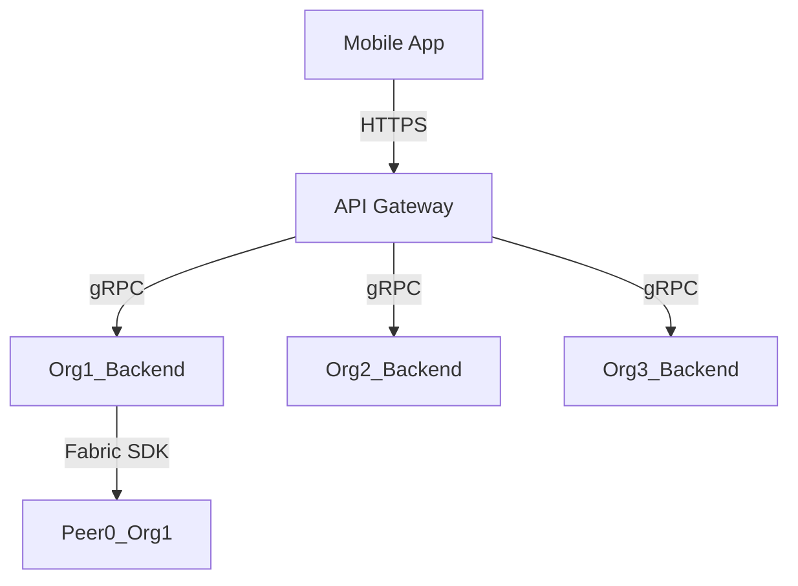

# Hyperledger Fabric Split Deployment Guide

## Overview

This guide provides the architecture and implementation details for splitting the current monolithic Hyperledger Fabric deployment into independent organization-specific deployments while maintaining a unified consortium.

## Current Architecture Analysis

### Single-Host Deployment



### Target Multi-Host Deployment



## Split Deployment Strategy

### 1. Certificate Authority Separation

**Current**: Single cryptogen execution generates all certificates
**Target**: Independent CA per organization

```bash
# Organization 1 - OEM
cryptogen generate --config=org1-crypto-config.yaml --output=crypto-config/org1

# Organization 2 - Manufacturer  
cryptogen generate --config=org2-crypto-config.yaml --output=crypto-config/org2

# Organization 3 - Carrier
cryptogen generate --config=org3-crypto-config.yaml --output=crypto-config/org3

# Orderer Organization
cryptogen generate --config=orderer-crypto-config.yaml --output=crypto-config/orderer
```

### 2. Network Configuration Updates

**configtx.yaml Modifications**:
```yaml
Organizations:
  - &Orderer
    Name: Orderer
    ID: OrdererMSP
    MSPDir: crypto-config/orderer/msp
    OrdererEndpoints:
      - orderer1.togettoyou.com:7050
      - orderer2.togettoyou.com:7050
      - orderer3.togettoyou.com:7050

  - &Org1
    Name: Org1
    ID: Org1MSP
    MSPDir: crypto-config/org1/msp
    AnchorPeers:
      - Host: peer0.org1.togettoyou.com
        Port: 7051

  - &Org2
    Name: Org2
    ID: Org2MSP
    MSPDir: crypto-config/org2/msp
    AnchorPeers:
      - Host: peer0.org2.togettoyou.com
        Port: 7051

  - &Org3
    Name: Org3
    ID: Org3MSP
    MSPDir: crypto-config/org3/msp
    AnchorPeers:
      - Host: peer0.org3.togettoyou.com
        Port: 7051
```

### 3. Docker Compose Split

**Current**: Single docker-compose.yaml with all services
**Target**: Multiple compose files with organization-specific services

#### Orderer Cluster Compose (orderer-compose.yaml)
```yaml
version: '2.1'

networks:
  fabric_network:
    name: fabric_togettoyou_network
    driver: bridge

services:
  orderer1.togettoyou.com:
    image: hyperledger/fabric-orderer:2.5.10
    container_name: orderer1.togettoyou.com
    environment:
      - ORDERER_GENERAL_LISTENADDRESS=0.0.0.0
      - ORDERER_GENERAL_LISTENPORT=7050
      - ORDERER_GENERAL_LOCALMSPID=OrdererMSP
      - ORDERER_GENERAL_LOCALMSPDIR=/etc/hyperledger/orderer/msp
      - ORDERER_GENERAL_TLS_ENABLED=true
    ports:
      - "7050:7050"
    volumes:
      - ./config/genesis.block:/etc/hyperledger/config/genesis.block
      - ./crypto-config/orderer/orderers/orderer1.togettoyou.com/:/etc/hyperledger/orderer
      - ./data/orderer1.togettoyou.com:/var/hyperledger/production/orderer
    networks:
      - fabric_network

  orderer2.togettoyou.com:
    # Similar configuration for orderer2
    
  orderer3.togettoyou.com:
    # Similar configuration for orderer3
```

#### Organization-Specific Compose (org1-compose.yaml)
```yaml
version: '2.1'

networks:
  fabric_network:
    name: fabric_togettoyou_network
    external: true

services:
  peer0.org1.togettoyou.com:
    image: hyperledger/fabric-peer:2.5.10
    container_name: peer0.org1.togettoyou.com
    environment:
      - CORE_PEER_ID=peer0.org1.togettoyou.com
      - CORE_PEER_LOCALMSPID=Org1MSP
      - CORE_PEER_ADDRESS=peer0.org1.togettoyou.com:7051
      - CORE_PEER_GOSSIP_BOOTSTRAP=peer1.org1.togettoyou.com:7051
      - CORE_PEER_GOSSIP_EXTERNALENDPOINT=peer0.org1.togettoyou.com:7051
      - CORE_PEER_TLS_ENABLED=true
    ports:
      - "7051:7051"
      - "7053:7053"
    volumes:
      - ./crypto-config/org1/peers/peer0.org1.togettoyou.com:/etc/hyperledger/peer
      - ./data/peer0.org1.togettoyou.com:/var/hyperledger/production
    networks:
      - fabric_network

  peer1.org1.togettoyou.com:
    # Similar configuration for peer1

  org1-backend:
    image: togettoyou/fabric-realty.server:latest
    container_name: org1-backend
    volumes:
      - ./crypto-config/org1:/network/crypto-config
      - ./data:/app/data
    ports:
      - "8080:8080"
    networks:
      - fabric_network
    environment:
      - ORG_ROLE=org1
      - FABRIC_GATEWAY_PEER=peer0.org1.togettoyou.com:7051

  org1-frontend:
    image: togettoyou/fabric-realty.web:latest
    container_name: org1-frontend
    ports:
      - "8000:80"
    networks:
      - fabric_network
    environment:
      - VUE_APP_API_BASE_URL=http://org1-backend:8080
```

### 4. Cross-Host Communication

**DNS Configuration**:
```bash
# /etc/hosts entries for all hosts
192.168.1.10 peer0.org1.togettoyou.com peer1.org1.togettoyou.com
192.168.1.20 peer0.org2.togettoyou.com peer1.org2.togettoyou.com  
192.168.1.30 peer0.org3.togettoyou.com peer1.org3.togettoyou.com
192.168.1.40 orderer1.togettoyou.com
192.168.1.41 orderer2.togettoyou.com
192.168.1.42 orderer3.togettoyou.com
```

**Firewall Rules**:
```bash
# Allow Fabric communication ports
ufw allow 7050/tcp  # Orderer
ufw allow 7051/tcp  # Peer gossip
ufw allow 7052/tcp  # Peer chaincode
ufw allow 7053/tcp  # Peer events
ufw allow 8080/tcp  # Backend API
ufw allow 80/tcp    # Frontend
```

### 5. Deployment Sequence



**Step-by-Step Deployment**:

1. **Host Preparation**
   ```bash
   # On all hosts
   apt-get update && apt-get install -y docker.io docker-compose
   systemctl enable docker
   systemctl start docker
   ```

2. **Orderer Cluster Deployment**
   ```bash
   # On orderer host
   docker-compose -f orderer-compose.yaml up -d
   docker exec orderer1.togettoyou.com orderer version
   ```

3. **Organization Deployment**
   ```bash
   # On each organization host
   docker-compose -f org1-compose.yaml up -d
   docker exec peer0.org1.togettoyou.com peer version
   ```

4. **Channel Creation**
   ```bash
   # Using CLI tool on any host
   peer channel create -o orderer1.togettoyou.com:7050 -c mychannel -f channel.tx --tls --cafile tls-cert.pem
   ```

5. **Peer Joining**
   ```bash
   # On each organization host
   docker exec -e "CORE_PEER_ADDRESS=peer0.org1.togettoyou.com:7051" peer0.org1.togettoyou.com peer channel join -b mychannel.block
   ```

### 6. Application Configuration

**Backend Configuration (config-docker.yaml)**:
```yaml
fabric:
  channelName: mychannel
  chaincodeName: mychaincode
  organizations:
    org1:
      mspID: Org1MSP
      certPath: /network/crypto-config/org1/users/User1@org1.togettoyou.com/msp/signcerts
      keyPath: /network/crypto-config/org1/users/User1@org1.togettoyou.com/msp/keystore
      tlsCertPath: /network/crypto-config/org1/peers/peer0.org1.togettoyou.com/tls/ca.crt
      peerEndpoint: peer0.org1.togettoyou.com:7051
      gatewayPeer: peer0.org1.togettoyou.com
```

**Environment Variables**:
```env
# Organization-specific backend configuration
ORG_ROLE=org1
FABRIC_GATEWAY_PEER=peer0.org1.togettoyou.com:7051
FABRIC_MSP_ID=Org1MSP
FABRIC_CERT_PATH=/network/crypto-config/org1/users/User1@org1.togettoyou.com/msp/signcerts
FABRIC_KEY_PATH=/network/crypto-config/org1/users/User1@org1.togettoyou.com/msp/keystore
FABRIC_TLS_CERT_PATH=/network/crypto-config/org1/peers/peer0.org1.togettoyou.com/tls/ca.crt
```

## Client Deployment Strategy

### Web Application Deployment

**Options**:

1. **Organization-Specific Frontend**: Each org deploys their own frontend
   - Pros: Complete control, custom branding
   - Cons: Higher maintenance overhead

2. **Centralized Frontend with Role-Based Access**: Single frontend with organization switching
   - Pros: Lower maintenance, consistent UX
   - Cons: Less organizational autonomy

**Recommended Approach**: Organization-specific frontends with shared UI components

### Mobile Client Strategy

**Architecture**:


**Implementation**:
```javascript
// Mobile client configuration
const config = {
  org1: {
    apiUrl: 'https://org1-api.togettoyou.com',
    mspId: 'Org1MSP'
  },
  org2: {
    apiUrl: 'https://org2-api.togettoyou.com', 
    mspId: 'Org2MSP'
  },
  org3: {
    apiUrl: 'https://org3-api.togettoyou.com',
    mspId: 'Org3MSP'
  }
};
```

## Monitoring and Maintenance

### Health Monitoring

**Prometheus Configuration**:
```yaml
scrape_configs:
  - job_name: 'fabric-orderers'
    static_configs:
      - targets: ['orderer1.togettoyou.com:9443', 'orderer2.togettoyou.com:9443', 'orderer3.togettoyou.com:9443']
  
  - job_name: 'fabric-peers'
    static_configs:
      - targets: 
        - 'peer0.org1.togettoyou.com:9443'
        - 'peer1.org1.togettoyou.com:9443'
        - 'peer0.org2.togettoyou.com:9443'
        - 'peer1.org2.togettoyou.com:9443'
        - 'peer0.org3.togettoyou.com:9443'
        - 'peer1.org3.togettoyou.com:9443'
```

### Backup Strategy

**Ledger Backup**:
```bash
# Daily ledger backup script
docker exec peer0.org1.togettoyou.com tar czvf /backup/ledger-$(date +%Y%m%d).tar.gz /var/hyperledger/production/ledgersData
```

**Certificate Backup**:
```bash
# Weekly certificate backup
tar czvf crypto-backup-$(date +%Y%m%d).tar.gz crypto-config/
```

## Troubleshooting

### Common Issues and Solutions

**Issue 1**: Cross-host communication failures
- **Symptoms**: Peer cannot connect to orderer, gossip failures
- **Solution**: Verify DNS resolution and firewall rules
```bash
# Test connectivity
ping orderer1.togettoyou.com
telnet orderer1.togettoyou.com 7050
```

**Issue 2**: Certificate trust errors
- **Symptoms**: TLS handshake failures, authentication errors
- **Solution**: Verify certificate chains and CA cross-signing
```bash
# Verify certificate
openssl x509 -in cert.pem -text -noout
```

**Issue 3**: Channel synchronization issues
- **Symptoms**: Different ledger heights across peers
- **Solution**: Check gossip connectivity and block propagation
```bash
# Check ledger height
peer channel getinfo -c mychannel
```

## Conclusion

This split deployment strategy enables:

1. **Independent Organization Management**: Each org controls their own infrastructure
2. **Enhanced Security**: Separate MSP boundaries with independent CAs
3. **Scalable Architecture**: Support for additional organizations and nodes
4. **Operational Resilience**: Fault isolation between organization deployments

**Next Steps**:
- Implement DNS resolution for cross-host communication
- Develop organization-specific deployment scripts
- Create automated monitoring and alerting
- Establish backup and disaster recovery procedures